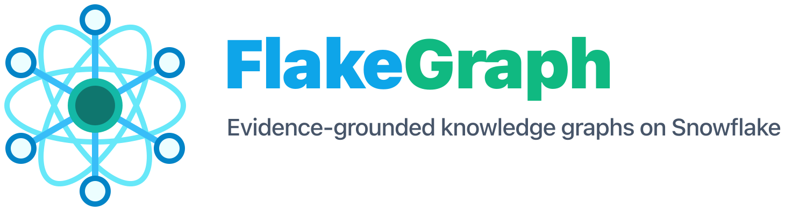

<p align="center">
  
</p>

# FlakeGraph

FlakeGraph turns documents into evidence-backed knowledge graphs. It extracts
text, identifies entities and relationships, resolves identities across
documents, validates every fact against the passage it came from, and writes
the graph as local artifacts or Snowflake tables. A console lets you upload
documents, watch a run, and explore and question the finished graph.

It runs on a laptop with no GPU, on a Kubernetes cluster for large corpora,
or with Snowflake as the destination for the graph. The processing core
depends on provider interfaces rather than vendor SDKs, so file sources, OCR,
LLMs, embeddings, caches and graph writers are selected independently in
configuration.

[](docs/assets/flakegraph-pipeline.svg)

[Read how each processing stage works](docs/algorithm.md), including the
entity-first relation extraction contract and the differences between local,
Kubernetes, and Snowflake execution.

## Quick Start

The quick start needs Python 3.12 or newer, [uv](https://docs.astral.sh/uv/),
[Ollama](https://ollama.com/) and, for the console, [Bun](https://bun.sh/).
No GPU and no account: the default profile reads the text layer documents
already carry, runs an 8B Qwen3 model through Ollama, and embeds on the CPU.

```bash
# The model the default profile talks to, about 5 GB.
ollama pull qwen3:8b

uv sync --extra local-embeddings

# Build a graph from the bundled public corpus. Output lands in out/app.
uv run flakegraph worker --config configs/app-defaults.yaml --progress rich

# Open it in the console.
cd react && bun install && bun run dev
```

Open http://localhost:3000. Completed graphs open the entity, relation,
community and evidence explorer, and take questions; from the console you can
also upload your own documents or point at a directory, run preflight, and
start a new ingestion. Submitted graphs appear in the sidebar like a
conversation history. Graph views contain source text and evidence, so handle
them with the same care as the input documents. The CLI remains available for
headless and automated runs; `uv run flakegraph --help` lists its commands.

`configs/app-defaults.yaml` is the profile every run starts from; the
console replaces the source, providers and output with what you choose in the
form. Point it at any OpenAI-compatible endpoint or Azure OpenAI instead of
Ollama by changing the `llm` block, or select the provider in the console.

Scanned or image-only PDFs need a layout-aware OCR engine. MinerU is the
quality option; it supports Python 3.10-3.13, so install its CLI as an
isolated tool and select the `fallback` or `mineru_internal` OCR provider:

```bash
uv tool install --python 3.13 "mineru[pipeline]==3.4.4"
```

See [Configuration profiles](configs/README.md) for what each profile selects.

## Serving Your Own Model

With a CUDA GPU, serve an open model with [vLLM](https://docs.vllm.ai/en/latest/getting_started/installation.html)
and use the GPU profile, which pairs it with MinerU and local embeddings:

```bash
vllm serve Qwen/Qwen3-8B --port 8000
uv run flakegraph worker --config configs/local-vllm-mineru-oss.yaml --progress rich
```

Any model the server loads works; set `llm.model` to the name the server
reports. On a machine without a GPU, point `KG_LLM_ENDPOINT` at a server
running elsewhere. The Helm chart carries a complete serving plane (vLLM
behind a priority-aware gateway) with hardware-specific profiles; the DGX
Spark reference example under `deploy/examples` shows one such profile.

`uv run flakegraph serving sizing` checks whether a device has room for a
model's weights and KV cache at a given concurrency before you serve it.

## Deploy On Kubernetes

For a fleet, use the Helm chart and the
[Kubernetes deployment guide](docs/kubernetes-fleet.md). Workers pull
documents and extraction windows from a PostgreSQL queue under renewable
leases, KEDA scales them with the backlog, immutable artifacts live in
S3-compatible storage, and a Spark job finalizes the corpus. The chart also
publishes the console, the model gateway and the document-parsing shim as
hostnames on one domain behind a single sign-in gate; the API paths that
programs call keep their own key checks and are routed past it.

## Snowflake

Snowflake can be the destination for a graph built anywhere, or the runtime
for the whole pipeline with Cortex as the OCR, LLM and embedding provider.
The account-neutral profile and setup commands generate the objects, grants,
and container-service specification:

```bash
uv run flakegraph snowflake setup-sql --config configs/snowflake-cortex.yaml
uv run flakegraph snowflake access-check --config configs/snowflake-cortex.yaml
uv run flakegraph snowflake service-spec --config configs/snowflake-cortex.yaml
uv run flakegraph snowflake execute-job-sql --config configs/snowflake-cortex.yaml
```

See [Snowflake setup](docs/snowflake-setup.md). A Snowflake destination
creates its vector columns at `embedding.dimension` the first time the graph
tables are created, so keep the embedding model and width stable for a schema.

## Providers

Configuration selects adapters for each boundary:

| Boundary | Included adapters |
| --- | --- |
| Files | Uploads, local paths, manifests, Azure Blob Storage, S3-compatible buckets, Snowflake stages |
| OCR | Built-in text extraction, adaptive provider fallback, MinerU, Tesseract, generic HTTP, Snowflake Cortex |
| LLM | Ollama, vLLM, other OpenAI-compatible APIs, Azure OpenAI, Snowflake Cortex |
| Entity extraction | LLM or optional local GLiNER |
| Embeddings | Sentence-transformers, OpenAI-compatible APIs, Azure OpenAI, Snowflake Cortex |
| Cache | Local JSON or Snowflake |
| Writer | Local artifacts, direct Snowflake, Snowflake bulk load |

```bash
uv run flakegraph config providers
uv run flakegraph config print --config configs/local-mineru-oss.yaml
```

Provider implementations live under `src/kg_processor/adapters/` and implement
interfaces from `src/kg_processor/ports/`. See
[Architecture](docs/architecture.md) for the extension contract.

## Execution Modes

The same processing semantics are available in three runtimes:

| Mode | Use case | Coordination and storage |
| --- | --- | --- |
| Local | Development, evaluation, and single-host processing | One process, local cache and artifacts |
| Kubernetes | GPU fleets and large corpora | PostgreSQL leases, KEDA worker scaling, object storage, Spark finalization |
| Snowflake | Snowflake-native providers and graph storage | Stages, Cortex, Snowflake tables, optional SPCS container |

## Docker

Build the production image with MinerU support:

```bash
docker build --platform linux/amd64 -t flakegraph:mineru-oss .
```

Run it with an OpenAI-compatible LLM:

```bash
docker run --rm --platform linux/amd64 \
  -v "$PWD/data:/app/data:ro" \
  -v "$PWD/out:/app/out" \
  -v flakegraph-mineru-cache:/home/kgprocessor/.cache/mineru \
  -e KG_LLM_ENDPOINT \
  -e KG_LLM_MODEL \
  -e KG_LLM_API_KEY \
  -e KG_INPUT_PATH=data/martial_arts/files/martial-arts-overview.pdf \
  flakegraph:mineru-oss worker --config configs/local-mineru-oss.yaml
```

## Project Layout

```text
src/kg_processor/
  domain/       provider-independent graph and document models
  ports/        interfaces implemented by providers and infrastructure
  application/  processing, validation, distribution, and inspection services
  adapters/     provider and persistence implementations
  config/       typed settings, provider registry, and preflight checks

react/          Next.js console: the control plane for every runtime
configs/        reusable provider profiles and ontologies
data/           self-contained public benchmark datasets
deploy/         container launchers and Kubernetes Helm chart
docs/           architecture and deployment guides
tests/          unit, integration, packaging, and deployment contracts
```

## Tests

```bash
uv sync --extra dev
uv run ruff check .
uv run mypy src
uv run pytest
```

Integration tests that need a service skip themselves unless it is
configured; see [CONTRIBUTING.md](CONTRIBUTING.md) for the markers and
variables. The martial-arts dataset includes a gold graph and published
measurements. See [its dataset guide](data/martial_arts/README.md) and
[benchmark results](data/martial_arts/BENCHMARKS.md).

## Documentation

- [How FlakeGraph builds a graph](docs/algorithm.md)
- [The console](react/README.md)
- [Architecture](docs/architecture.md)
- [Configuration profiles](configs/README.md)
- [What a graph consumed, and what it cost](docs/consumption.md)
- [Kubernetes fleet deployment](docs/kubernetes-fleet.md)
- [Snowflake setup](docs/snowflake-setup.md)
- [Benchmark datasets](data/README.md)
- [Contributing](CONTRIBUTING.md), [security policy](SECURITY.md) and
  [code of conduct](CODE_OF_CONDUCT.md)
- [Third-party notices](THIRD_PARTY_NOTICES.md)

## License

FlakeGraph is released under the [Apache License 2.0](LICENSE); see
[NOTICE](NOTICE) for the copyright statement. Dependencies, models, provider
services and image variants retain their own licenses and terms; they are
listed in [THIRD_PARTY_NOTICES.md](THIRD_PARTY_NOTICES.md).

Community detection uses NetworkX's Louvain algorithm (BSD) by default. Leiden
is available as the optional `flakegraph[leiden]` extra with
`graph.community_algorithm: leiden`; its `igraph` and `leidenalg` packages are
GPL-licensed, so installing that extra changes the licence terms of the
combined installation. The published container images leave it out; build
them with `--build-arg KG_INSTALL_LEIDEN=true` to include it.
