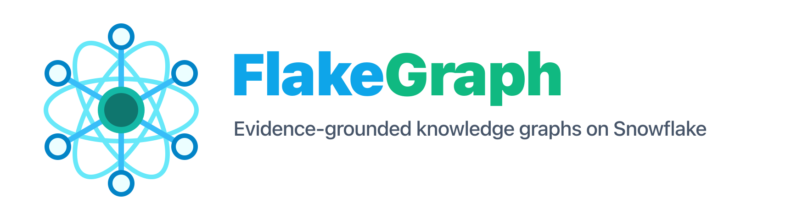

<p align="center">
  
</p>

# FlakeGraph

FlakeGraph turns documents into a grounded knowledge graph on Snowflake.

It reads documents, extracts text, asks an LLM to find entities and
relationships, validates every graph fact against source evidence, and writes
the result either to local files or to Snowflake tables.

The important design point is that the pipeline is provider-independent: OCR,
LLMs, embeddings, file input, caching, and graph writing are all provider
interfaces. A local run can use open-source tools such as MinerU and
sentence-transformers, while a Snowflake run can use Cortex, stages, tables,
and Snowpark Container Services without changing the core pipeline.

## How It Works

```text
input documents
  -> file source
  -> OCR / text extraction
  -> normalized pages, blocks, and chunks
  -> LLM graph extraction
  -> evidence validation and repair
  -> graph merge, filtering, embeddings, and communities
  -> local artifacts or Snowflake tables
```

Typical outputs are documents, pages, chunks, graph nodes, graph edges,
evidence links, entity sources, communities, quality metrics, trace events, and
run summaries.

## Quick Start

Use Python 3.13, `uv`, and real providers. This profile runs local MinerU OCR,
an OpenAI-compatible LLM endpoint, sentence-transformers embeddings, and local
Parquet/JSON artifact output.

```bash
uv sync --extra dev --extra ocr-mineru --extra local-embeddings

export KG_LLM_ENDPOINT="https://your-llm-endpoint"
export KG_LLM_MODEL="your-model"
export KG_LLM_API_KEY="your-api-key"
export KG_EMBED_DEVICE=cpu
export KG_INPUT_PATH=data/samples/martial-arts-overview.pdf

uv run flakegraph preflight --config configs/local-mineru-oss.yaml
uv run flakegraph worker --config configs/local-mineru-oss.yaml
uv run flakegraph inspect graph --output out/local-mineru-oss
```

The first MinerU and sentence-transformers run may download model files into
the local cache. Outputs are written under `out/local-mineru-oss`.

The legacy `kg-processor` command is still installed as an alias while the
project transitions to the FlakeGraph name.

Useful checks:

```bash
uv run flakegraph --version
uv run flakegraph config providers
uv run flakegraph config print --config configs/local-mineru-oss.yaml
uv run flakegraph preflight --config configs/local-mineru-oss.yaml
```

## Run With Docker

Build the production image:

```bash
docker build --platform linux/amd64 -t flakegraph:mineru-oss .
```

Run the lightweight CI smoke profile:

```bash
docker compose -f .github/docker-compose.smoke.yaml up --build flakegraph
```

Run the local MinerU profile in the container:

```bash
docker run --rm --platform linux/amd64 \
  -v "$PWD/data:/app/data:ro" \
  -v "$PWD/out:/app/out" \
  -v flakegraph-mineru-cache:/home/kgprocessor/.cache/mineru \
  -e KG_LLM_ENDPOINT \
  -e KG_LLM_MODEL \
  -e KG_LLM_API_KEY \
  -e KG_EMBED_DEVICE=cpu \
  -e KG_INPUT_PATH=data/samples/martial-arts-overview.pdf \
  flakegraph:mineru-oss worker --config configs/local-mineru-oss.yaml
```

## Provider Model

Configuration chooses the providers. The pipeline itself depends on interfaces
under `src/kg_processor/ports/`.

Common provider options:

- File sources: local files, manifests, Azure Blob Storage, Snowflake stages
- OCR: built-in text extraction, MinerU, Tesseract, generic HTTP OCR, Snowflake Cortex
- LLMs: fake test provider, OpenAI-compatible APIs, Azure OpenAI, vLLM, Snowflake Cortex
- Embeddings: hash test provider, sentence-transformers, OpenAI-compatible APIs, Azure OpenAI, Snowflake Cortex
- Writers: local artifacts, direct Snowflake writes, Snowflake bulk writes
- Cache: local files or Snowflake tables

List supported providers with:

```bash
uv run flakegraph config providers
```

## Snowflake Mode

Snowflake mode uses the same pipeline with Snowflake-backed providers:

- Snowflake stages for input documents and bulk load files
- Cortex for OCR, LLM calls, and embeddings
- Snowflake tables for graph outputs, cache, jobs, traces, and quality metrics
- Snowpark Container Services to run the Docker image

Generate the setup and deployment SQL:

```bash
uv run flakegraph snowflake setup-sql --config configs/snowflake-cortex.yaml
uv run flakegraph snowflake access-check --config configs/snowflake-cortex.yaml
uv run flakegraph snowflake service-spec --config configs/snowflake-cortex.yaml
uv run flakegraph snowflake execute-job-sql --config configs/snowflake-cortex.yaml
```

Snowflake-specific setup notes are in:

- [docs/snowflake-setup.md](docs/snowflake-setup.md)

## Project Layout

```text
src/kg_processor/
  ports/        interfaces for OCR, LLMs, embeddings, files, cache, writers
  adapters/     concrete provider implementations
  application/  pipeline, graph extraction, validation, merge, inspection
  domain/       document, graph, ID, and job models
  config/       typed settings, provider registry, preflight checks
  cli.py        command-line entry point

configs/        runnable local, Docker, Azure, vLLM, and Snowflake profiles
data/samples/   sample documents for repeatable tests and smoke runs
docs/           Snowflake setup guide and README assets
tests/          unit and integration tests
```

## Test

```bash
uv sync --extra dev
uv run ruff check .
uv run mypy src/kg_processor tests
uv run pytest
```

CI runs the same Python checks plus a Docker smoke test.

For a fast credential-free developer smoke check:

```bash
uv run flakegraph worker --config configs/local-smoke.yaml
uv run flakegraph inspect graph --output out/local-smoke
```

## More Detail

- [configs/README.md](configs/README.md)
- [docs/snowflake-setup.md](docs/snowflake-setup.md)
- [THIRD_PARTY_NOTICES.md](THIRD_PARTY_NOTICES.md)

## License

FlakeGraph source code is released under the [MIT License](LICENSE).
Dependencies, downloaded models, provider services, and Docker image variants
remain subject to their own licenses and terms. See
[THIRD_PARTY_NOTICES.md](THIRD_PARTY_NOTICES.md).
