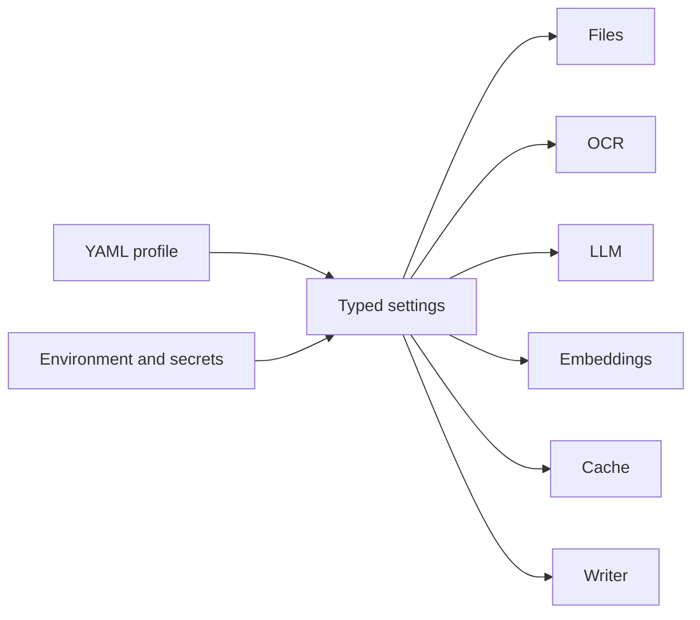
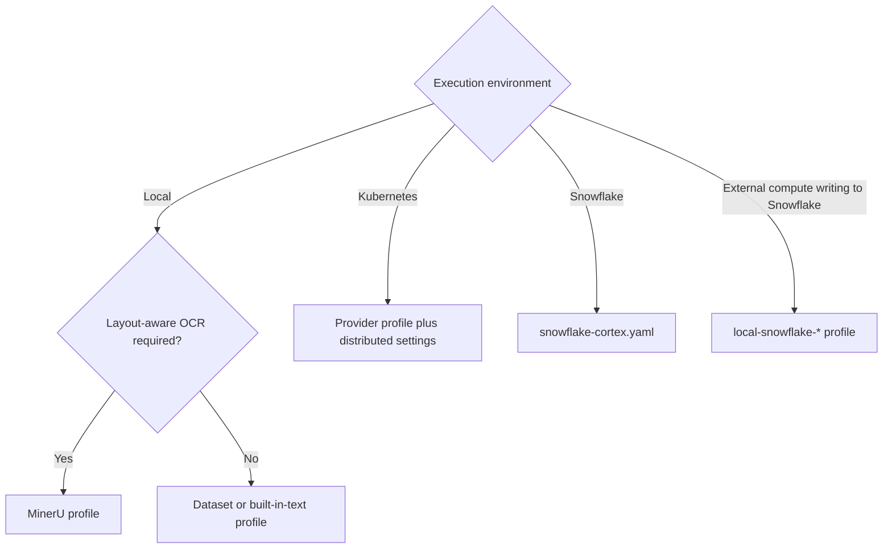

# Configuration

Each YAML profile selects one adapter per processing boundary. Environment
placeholders such as `${KG_LLM_API_KEY}` are resolved when settings load;
secrets should not be written into profiles.



Graph-processing defaults live in `Settings`, so changing a provider does not
silently change extraction semantics. Profiles should override graph settings
only for a documented model or corpus constraint.

## Profiles

| Profile | Purpose |
| --- | --- |
| `app-defaults.yaml` | Domain-neutral Streamlit and Kubernetes defaults with adaptive OCR, vLLM, local embeddings, and the general ontology |
| `local-mineru-oss.yaml` | Local MinerU OCR, OpenAI-compatible LLM, sentence-transformers, and local output |
| `local-mineru-openai.yaml` | Local MinerU with OpenAI-compatible LLM and embedding endpoints |
| `local-mineru-api.yaml` | Hosted MinerU API with OpenAI-compatible LLM and embeddings |
| `local-generic-http-ocr.yaml` | Generic HTTP OCR with an OpenAI-compatible LLM |
| `local-vllm-mineru-oss.yaml` | MinerU with local vLLM and sentence-transformers |
| `local-azure-foundry.yaml` | Local files with Azure OpenAI LLM and embeddings |
| `local-azure-blob-mineru-oss.yaml` | Azure Blob input, local MinerU, compatible LLM, and local output |
| `local-snowflake-direct.yaml` | Local processing with direct Snowflake graph writes |
| `local-snowflake-bulk.yaml` | Local processing with staged Snowflake bulk writes |
| `onprem-azure-blob-vllm-mineru-oss.yaml` | On-premises workers using Azure Blob, vLLM, MinerU, and Snowflake persistence |
| `snowflake-cortex.yaml` | Snowflake stages, Cortex providers, Snowflake cache, and bulk graph writes |

The general-purpose ontology is `ontologies/general.yaml`. Dataset-specific
profiles and ontologies live under `data/<dataset>/`; for example:

- `data/martial_arts/configs/local-vllm.yaml`
- `data/martial_arts/configs/kubernetes-vllm.yaml`

## Choosing A Profile



Inspect a fully resolved profile before running it:

```bash
uv run flakegraph config print --config configs/local-mineru-oss.yaml
uv run flakegraph preflight --config configs/local-mineru-oss.yaml
```

List all registered provider names with:

```bash
uv run flakegraph config providers
```

## File Sources

The application can compose these values for an interactive run; YAML profiles
use the same settings for headless workers.

| Source | Required settings | Authentication |
| --- | --- | --- |
| Local | `files.source: local`, `files.input_path` | Filesystem access |
| Manifest | `files.source: manifest`, `files.manifest_path` | Filesystem access |
| Azure Blob | `files.source: azure_blob`, `azure_blob.account_url`, `azure_blob.container` | SAS token, connection string, or Azure's default credential chain |
| S3-compatible | `files.source: s3`, `s3.bucket` | Standard boto3 credential chain; `s3.endpoint_url` is optional for MinIO and compatible stores |
| Snowflake stage | `files.source: snowflake_stage`, `snowflake.stage` | Active Snowflake connection or workload identity |

Remote sources stream supported objects into their configured `download_path`
before OCR while preserving the original object URI and content checksum as
provenance. `files.include_globs` filters paths below the selected prefix.

## Distributed Settings

A fleet profile adds a PostgreSQL task store and shared artifact storage. The
most important settings are:

| Setting | Purpose |
| --- | --- |
| `distributed.database_url` | PostgreSQL coordination database |
| `distributed.artifact_uri` | S3-compatible location for immutable stage artifacts |
| `distributed.worker_stages` | Queue stages a worker may claim: preparation, document context, windows, or finalization. |
| `distributed.lease_seconds` | Recovery period for abandoned work |
| `distributed.max_attempts` | Bounded task retry budget |
| `distributed.finalization_engine` | `auto`, `local`, or `spark` |
| `distributed.spark_executor_instances` | Parallel Spark executors |
| `distributed.spark_executor_cores` | Task slots per executor |

Worker identity, stage eligibility, and lease timing may differ across pods;
processing settings must match the submitted run. The Helm chart supplies the
runtime-specific values described in
[Kubernetes fleet deployment](../docs/kubernetes-fleet.md).

## Naming

- `local-*`: one host or an externally scheduled container
- `onprem-*`: non-Snowflake compute integrated with shared services
- `snowflake-*`: Snowflake-native providers or deployment artifacts
