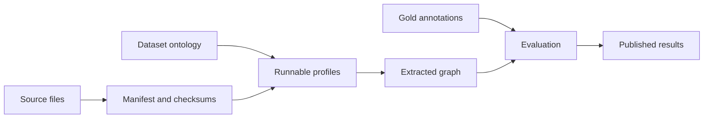

# Benchmark Datasets

Each benchmark dataset is packaged under `data/`. Public-domain sources can live
beside their annotations; externally licensed sources instead provide a downloader
that materializes ignored files locally. Keeping the catalog, annotations,
ontology, terms, and runnable profiles together makes either form portable without
redistributing content the repository does not own.

```text
data/<dataset_id>/
  README.md       scope, provenance, counts, and usage
  BENCHMARKS.md   dataset-specific measurements and protocol
  LICENSE.md      license for the dataset artifacts
  manifest.jsonl  source-file metadata and checksums
  gold.json       annotated entities, relations, and evidence
  ontology.yaml   extraction vocabulary and relation constraints
  files/          source documents consumed by FlakeGraph
  configs/        dataset-specific local and distributed profiles
  results/        compact published benchmark measurements
```

Provider examples that are useful across datasets remain in `configs/`. Profiles tied
to one benchmark corpus belong with that dataset and should use repository-relative
paths so commands work from the project root.



## Available Datasets

| Dataset | Documents | Gold Graph | License |
| --- | ---: | ---: | --- |
| [Martial Arts History](martial_arts/README.md) | 10 | 74 entities / 104 relations | CC0-1.0 |
| [Famous Deep Learning Papers](deep_learning_papers/README.md) | 49 | 659 entities / 742 relations | Source-specific |

## Benchmark Protocol

Comparable result records identify the dataset version, ontology, complete
processing configuration, model artifact, serving runtime, hardware, and repeat
count. A published measurement should:

- process the complete manifest with cross-run caches disabled;
- warm model services before timing;
- include at least three successful repetitions;
- report quality, evidence, topology, timing, throughput, and stability metrics;
- keep each run's output isolated; and
- omit credentials, private endpoints, usernames, and hostnames.

Run the local protocol with:

```bash
uv run flakegraph benchmark extraction \
  --config data/martial_arts/configs/local-vllm-qwen36.yaml \
  --gold data/martial_arts/gold.json \
  --repeats 3 \
  --output out/benchmarks/martial-arts
```

Each dataset publishes its measurements in `BENCHMARKS.md` and compact
machine-readable records under `results/`.
