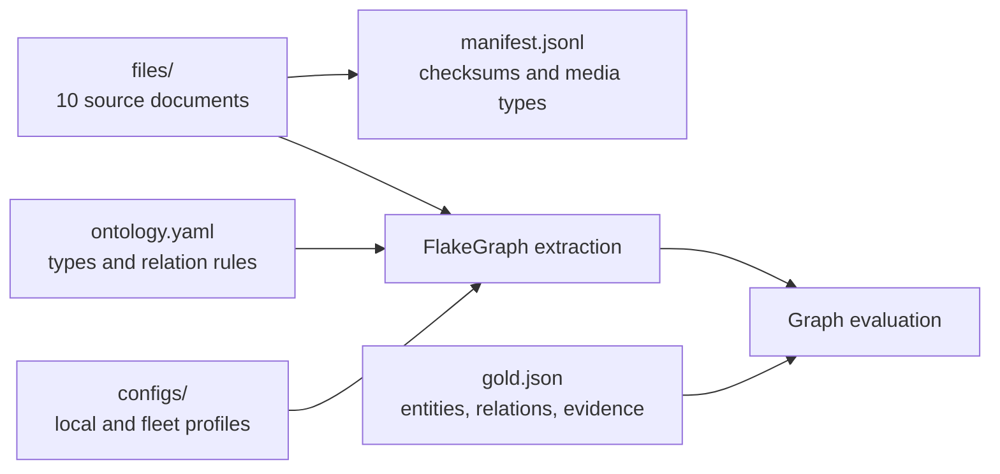

# Martial Arts History

This public benchmark dataset covers selected martial arts, combat sports, people,
institutions, practices, and events. Its ten documents were authored for
FlakeGraph and contain no third-party prose, images, or private business data.

The dataset is dedicated under CC0-1.0. See [LICENSE.md](LICENSE.md).



## Contents

| Path | Purpose |
| --- | --- |
| `BENCHMARKS.md` | Published measurements, status interpretation, and reproduction protocol. |
| `files/` | PDF, DOCX, PPTX, HTML, Markdown, and text source documents. |
| `manifest.jsonl` | Relative file paths, source URIs, SHA-256 checksums, byte sizes, and MIME types. |
| `gold.json` | Canonical entities, directed relations, aliases, evidence observations, and quality thresholds. |
| `ontology.yaml` | Entity vocabulary, relation signatures, inverses, aliases, and self-loop policy. |
| `configs/local-ollama-qwen36.yaml` | Portable Ollama profile used by the repository quick start. |
| `configs/local-vllm-qwen36.yaml` | Local vLLM benchmark profile. |
| `configs/kubernetes-vllm-qwen36.yaml` | Distributed Kubernetes benchmark profile. |
| `results/` | Compact published quality, timing, runtime, and hardware measurements. |
| `LICENSE.md` | CC0 dedication for this dataset. |

## Document Matrix

| File | Format | Coverage |
| --- | --- | --- |
| `files/smoke.txt` | TXT | Compact connected facts used by pipeline and Docker checks. |
| `files/martial-arts-overview.pdf` | PDF | Techniques, institutions, and practices. |
| `files/martial-arts-lineages.pdf` | PDF | Teachers, transmission, and cautious influence. |
| `files/martial-arts-interview.docx` | DOCX | Training, historical evidence, and adaptation. |
| `files/martial-arts-schools.pptx` | PPTX | Institutional history and evidence anchors. |
| `files/martial-arts-timeline.html` | HTML | Codification and public events. |
| `files/martial-arts-rules-and-regulators.md` | Markdown | Rulesets, federations, and regulation. |
| `files/martial-arts-olympic-program.md` | Markdown | Olympic recognition, demonstrations, and medal programmes. |
| `files/martial-arts-living-heritage.txt` | TXT | UNESCO recognition and living cultural practices. |
| `files/martial-arts-crossroads.md` | Markdown | Cross-regional exchange, travel, and hybrid practice. |

The annotated reference topology contains 74 canonical entities, 91 required
relations, 13 additional accepted relations, and 109 exact evidence observations.
It forms one connected graph, while
repeated facts across documents exercise entity resolution and evidence aggregation.
The reference is intentionally not an exhaustive inventory of every valid concept in
the prose. Evaluation therefore scores entity recall against the selected reference
and relation precision within the subgraph induced by matched reference entities;
additional grounded entities and relations touching them are reported as unscored.
Structural acceptance is measured on that same reference-induced subgraph, while
whole-output structural diagnostics remain available separately.
`gold.json` is the evaluation contract used by every published result.

## Run Locally

Install Ollama and pull `qwen3.6:35b-a3b-q4_K_M`, then run:

```bash
uv run flakegraph preflight \
  --config data/martial_arts/configs/local-ollama-qwen36.yaml

uv run flakegraph worker \
  --config data/martial_arts/configs/local-ollama-qwen36.yaml \
  --progress rich

uv run flakegraph inspect evaluate \
  --output out/local-ollama-qwen36 \
  --gold data/martial_arts/gold.json
```

`tests/unit/test_sample_data_contract.py` verifies manifest consistency, file and
annotation checksums, ontology references, connected topology, and exact source
evidence.
