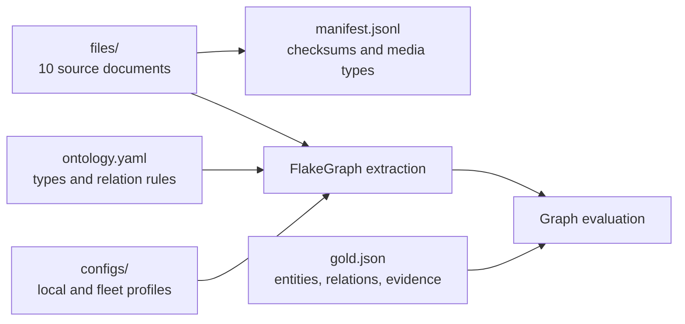

# Martial Arts History

This public benchmark dataset covers selected martial arts, combat sports, people,
institutions, practices, and events. Its ten documents were authored for
FlakeGraph and contain no third-party prose, images, or private business data.

The dataset is dedicated under CC0-1.0. See [LICENSE.md](LICENSE.md).



## Contents

| Path | Purpose |
| --- | --- |
| `BENCHMARKS.md` | Published measurements, status interpretation, and reproduction protocol. |
| `files/` | PDF, DOCX, PPTX, HTML, Markdown, and text source documents. |
| `manifest.jsonl` | Relative file paths, source URIs, SHA-256 checksums, byte sizes, and MIME types. |
| `gold.json` | Canonical entities, directed relations, aliases, evidence observations, and quality thresholds. |
| `ontology.yaml` | Entity vocabulary, relation signatures, inverses, aliases, and self-loop policy. |
| `configs/local-vllm.yaml` | Local vLLM (GPU) profile for this corpus. |
| `configs/kubernetes-vllm.yaml` | Distributed Kubernetes benchmark profile. |
| `results/` | Compact published quality, timing, runtime, and hardware measurements. |
| `LICENSE.md` | CC0 dedication for this dataset. |

## Document Matrix

| File | Format | Coverage |
| --- | --- | --- |
| `files/smoke.txt` | TXT | Compact connected facts used by pipeline and Docker checks. |
| `files/martial-arts-overview.pdf` | PDF | Techniques, institutions, and practices. |
| `files/martial-arts-lineages.pdf` | PDF | Teachers, transmission, and cautious influence. |
| `files/martial-arts-interview.docx` | DOCX | Training, historical evidence, and adaptation. |
| `files/martial-arts-schools.pptx` | PPTX | Institutional history and evidence anchors. |
| `files/martial-arts-timeline.html` | HTML | Codification and public events. |
| `files/martial-arts-rules-and-regulators.md` | Markdown | Rulesets, federations, and regulation. |
| `files/martial-arts-olympic-program.md` | Markdown | Olympic recognition, demonstrations, and medal programmes. |
| `files/martial-arts-living-heritage.txt` | TXT | UNESCO recognition and living cultural practices. |
| `files/martial-arts-crossroads.md` | Markdown | Cross-regional exchange, travel, and hybrid practice. |

The gold annotates the corpus exhaustively (version 2.1.0): 119 canonical
entities and 148 relations (135 required, 13 additional accepted), with 161
exact evidence observations. Every entity and relation of the ontology that the
documents state is listed, so the evaluator scores precision and F1 as well as
recall: an extracted entity or relation the gold does not list counts as a
false positive. Everything that takes part in a relation forms one connected
graph; named entities the text mentions without a stated relation stand alone,
and a year or era is listed only where it takes part in a stated relation.

The gold starts from a hand-written reference (version 1.0.0: 74 entities and
104 relations, scored on recall only). Every entity and relation that GPT-6
astra and Qwen 3.8 extractions found beyond it was judged against the text; a
full reading of each document added what the extractions missed; and the
deduplicated findings of four further astra extractions were validated against
the text, with a separate tie-break wherever two judges disagreed. Results
measured on 1.0.0 remain in `results/` as a record of that version; the
console's Quality tab compares a graph only with results on the current one.
`gold.json` is the evaluation contract used by every published result.

## Run Locally

Without a GPU, run the repository quick start in the root README against
`configs/app-defaults.yaml` (Ollama) and point it at this corpus. With a CUDA GPU,
serve an open model with vLLM (`vllm serve Qwen/Qwen3-8B`), then run:

```bash
uv run flakegraph preflight \
  --config data/martial_arts/configs/local-vllm.yaml

uv run flakegraph worker \
  --config data/martial_arts/configs/local-vllm.yaml \
  --progress rich

uv run flakegraph inspect evaluate \
  --output out/local-vllm \
  --gold data/martial_arts/gold.json
```

`tests/unit/test_sample_data_contract.py` verifies manifest consistency, file and
annotation checksums, ontology references, connected topology, and exact source
evidence.
