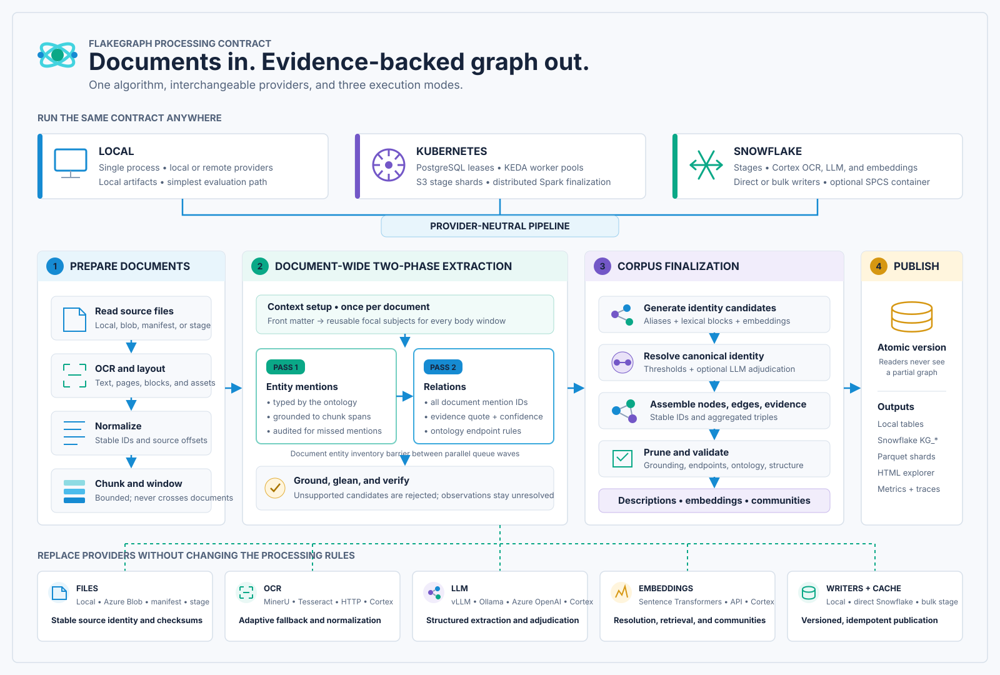

# How FlakeGraph Builds A Knowledge Graph

FlakeGraph converts source documents into canonical nodes and evidence-backed
edges through one provider-neutral processing contract. The same logical stages
run locally, across a Kubernetes fleet, or with Snowflake providers and storage.

## Processing Stages

| Stage | Input | Work performed | Durable result |
| --- | --- | --- | --- |
| Prepare | Source files | OCR or text extraction, layout normalization, stable document identity, bibliography-aware chunking, and bounded document windows | Documents, pages, blocks, assets, and chunks with source offsets |
| Document context | Bounded front matter | Identify ontology-declared focal subjects such as the paper, method, product, or organization once per document | Reusable grounded context mentions for every body window |
| Entity extraction | Bounded document windows | Extract grounded entity mentions in parallel, with bounded gleaning and cue-based audits | Independently mergeable mention observations |
| Entity inventory | Every entity window for one document | Deduplicate mentions into one immutable document-wide endpoint vocabulary | A complete entity inventory shared by relation windows |
| Relation extraction | Bounded document windows plus the document inventory | Extract and optionally verify grounded relations in parallel | Independently mergeable relation observations with quotes, confidence, and provenance |
| Finalize | All observation shards in the corpus | Resolve identity, assemble canonical edges, remove invalid or isolated records, merge descriptions, embed graph records, detect communities, and evaluate quality | Canonical graph tables, evidence, communities, metrics, and traces |
| Publish | Validated graph tables | Write a complete version and atomically move the graph head | Local artifacts, Snowflake tables, or an exported distributed graph |

## The Two-Pass Contract

“Two-pass” describes two parallel phases per document. It is not two complete
serial runs over the corpus.

1. **Entity pass.** Independently queueable windows emit typed mentions grounded
   to chunk spans. FlakeGraph applies ontology constraints and can run bounded
   gleaning or cue-based audits for missed mentions. Local threads or fleet
   workers process these windows concurrently.
2. **Inventory barrier.** FlakeGraph deduplicates all accepted mentions for one
   document. This is a metadata-only operation with no provider calls.
3. **Relation pass.** Every window receives the complete document inventory and
   may reference only those accepted IDs. A relation can therefore connect an
   endpoint introduced in another window without inventing a free-text endpoint.
   Relation windows remain independent and run concurrently. Each observation
   carries source evidence, and candidates requiring semantic judgment pass
   through the configured verifier.

Before these passes, the document-context stage inspects bounded front matter.
It makes document-level subjects available to body windows without repeating
the title and contribution framing in every model call. Bibliography-only
windows are excluded from ordinary extraction. Kubernetes packs a small bounded
number of logical windows into each lease to reduce queue and object-store
cardinality; model calls remain separate and use bounded in-task parallelism.

Extraction deliberately stops at observations. Mentions such as “BERT,” “the
BERT model,” and a longer formal name remain distinct until the complete corpus
is available for resolution.

## Corpus Finalization

Finalization turns mergeable observations into a graph:

1. Filter malformed, low-confidence, ungrounded, and ontology-invalid records.
2. Generate bounded identity candidates using aliases, normalized lexical
   forms, and semantic embeddings.
3. Auto-merge only high-confidence candidates and use optional LLM adjudication
   for ambiguous pairs.
4. Compute identity components and choose stable canonical names, types, IDs,
   aliases, and descriptions.
5. Map relation endpoints to canonical node IDs, remove disallowed self-loops,
   aggregate repeated triples, and preserve every supporting evidence record.
6. Optionally remove isolated entities, then calculate node degree and graph
   structure.
7. Merge source-specific descriptions and generate embeddings for retrieval.
8. Detect communities from canonical relations plus a bounded, linear-size
   co-mention topology; generate grounded reports and embed those reports.
9. Run evidence, endpoint, ontology, uniqueness, and structural quality checks.
10. Publish a complete graph version atomically, so readers never observe a
    partially finalized graph.

Local execution performs this contract in one process. Kubernetes stores
immutable stage shards in S3-compatible storage and uses Spark for partitioned
finalization. Snowflake execution can select Cortex OCR, LLM, and embedding
adapters and publish through direct or staged Snowflake writers.

## Replaceable Providers

The algorithm depends on ports rather than vendor SDKs. File sources, OCR, LLM,
embedding, cache, and writer adapters are selected independently in YAML. A
local run can therefore use MinerU with vLLM and write local artifacts, while a
different deployment uses Snowflake stages, Cortex, and `KG_*` tables without
forking the processing rules.

The implementation boundaries and provider extension contract are documented
in [Architecture](architecture.md). Fleet scheduling, leases, autoscaling, and
Spark execution are documented in [Kubernetes fleet deployment](kubernetes-fleet.md).
