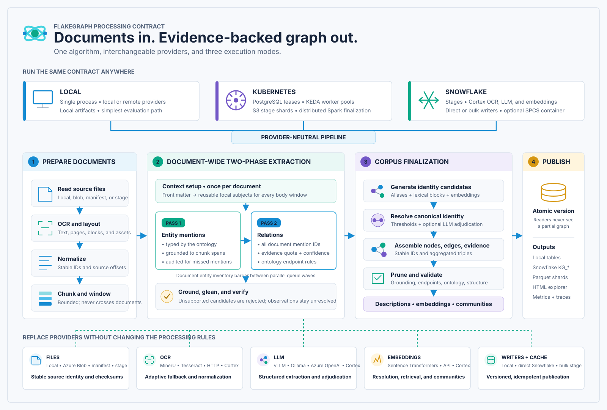

# How FlakeGraph Builds A Knowledge Graph

FlakeGraph converts source documents into canonical nodes and evidence-backed
edges through one provider-neutral processing contract. The same logical stages
run locally, across a Kubernetes fleet, or with Snowflake providers and storage.

## Processing Stages

| Stage | Input | Work performed | Durable result |
| --- | --- | --- | --- |
| Prepare | Source files | OCR or text extraction, layout normalization, stable document identity, bibliography-aware chunking, and bounded document windows | Documents, pages, blocks, assets, and chunks with source offsets |
| Document context | Bounded front matter | Identify ontology-declared focal subjects such as the paper, method, product, or organization once per document; profile a dataset instead (catalogue, measurements, or other) and map a catalogue's columns to ontology relations | Reusable grounded context mentions for every body window; a dataset's kind, summary, and column relations |
| Entity extraction | Bounded document windows | Extract grounded entity mentions in parallel, with bounded gleaning and cue-based audits | Independently mergeable mention observations |
| Entity inventory | Every entity window for one document | Deduplicate mentions into one immutable document-wide endpoint vocabulary | A complete entity inventory shared by relation windows |
| Relation extraction | Bounded document windows plus the document inventory and opening | Extract and ground relations, then verify them and the window's entities, in parallel | Independently mergeable relation observations with quotes, stated values, confidence, and provenance |
| Finalize | All observation shards in the corpus | Resolve identity, assemble canonical edges, remove invalid or isolated records, merge descriptions, embed graph records, detect communities, and evaluate quality | Canonical graph tables, evidence, communities, metrics, and traces |
| Publish | Validated graph tables | Write a complete version and atomically move the graph head | Local artifacts, Snowflake tables, or an exported distributed graph |

A document's chunks overlap by a few tokens, and a chunk whose text repeats an
earlier chunk of the same document - a sheet copied into another, a page
printed twice - is left out: the facts it holds keep the first copy as their
evidence, and no extraction call reads the same text twice.

## The Two-Pass Contract

“Two-pass” describes two parallel phases per document. It is not two complete
serial runs over the corpus.

1. **Entity pass.** Independently queueable windows emit typed mentions grounded
   to chunk spans. FlakeGraph applies ontology constraints and can run bounded
   gleaning or cue-based audits for missed mentions. Local threads or fleet
   workers process these windows concurrently.
2. **Inventory barrier.** FlakeGraph deduplicates all accepted mentions for one
   document. This is a metadata-only operation with no provider calls.
3. **Relation pass.** Every window receives the complete document inventory and
   a table of which relations each of its entity types may start and end. A
   relation references accepted IDs, so it can connect an endpoint introduced
   in another window. With `graph.relation_new_endpoints` (off by default),
   when its other end is a named thing of an ontology type the inventory lacks,
   the response may add it as a new endpoint (up to six a call); an added
   endpoint is grounded like any entity and joins the inventory, even if the
   relation that needed it is rejected. Relation windows
   remain independent and run concurrently. Each observation carries source
   evidence, and candidates requiring semantic judgment pass through the
   configured verifier.

Before these passes, the document-context stage inspects bounded front matter.
It makes document-level subjects available to body windows without repeating
the title and contribution framing in every model call. Bibliography-only
windows are excluded from ordinary extraction. On Kubernetes every window is a
task of its own, so a worker slot that finishes early takes the next window of
any document, and a retry repeats one window's model calls and no others.

## What The Model Is Told

The prompts (`src/kg_processor/prompts/`) are the same for any corpus; what a
domain means by its types and relations reaches the model in the ontology,
which every call carries as data - each type's and relation's description,
types, evidence cues, `guidance`, and `counter_examples`. The entity and
relation prompts ask for every stated thing and statement, and carry a few
conditional rules that apply only when an ontology configures the types they
name (goals and tasks, models, publication metadata); on the reference model,
prompts that told it what not to return cost about a third of the true entities
and an eighth of the true relations it found, so exclusions are left to
validation and verification. The reading rules verification applies:

- A certificate, form, label, or data sheet names its subject in the header;
  each row is an attribute of that subject, and its limit and result are
  values, never entities. A column of codes names a method only where a cell
  holds a method's name. Signature, prepared-by, and page lines state nothing.
- A table cell relates to its row label and its column header.
- Position alone is not a relation: neighbouring lines, a shared list, or a
  heading above do not relate things, and a listed item is not part of the
  document that lists it.
- A cited work is the source of a claim, not its subject.
- A number or label that a legend defines ("compound 3") stands for the name
  the legend gives: the name is the entity, the number its alias there. A code
  that identifies a thing is its alias too.
- Class terms and headings ("suppliers", a section title) are not entities.

A prompt change bumps `TWO_PASS_PROMPT_REVISION`, which every extraction trace
and cache key records.

## Evidence Grounding

Every entity and relation keeps an exact span of source text as its evidence.
Grounding is the deterministic check - string matching, no model call - that
makes this true. The model returns a quote and names the chunk it came from;
grounding then:

1. Looks for the quote in that chunk, tolerating differences in whitespace,
   letter case, compatibility characters such as ligatures, and line-break
   hyphens (a quote may keep the hyphen or drop it), but never a changed or
   missing word. HTML character references a parser left in the text ("&amp;")
   read as their characters, and table markup - HTML cell tags and cell bars -
   reads as whitespace, so a quote that reads across a table row as prose
   ("Product Name: EMULSA WAX") matches the cells it spans.
2. For a relation, requires each endpoint's name, alias, or local surface as a
   whole-word match inside the quote, the two mentions not overlapping. Letters
   and digits within a name may be written together or apart ("GG918",
   "GG-918"); a name's last word may carry a plural or genitive ending ("Acme
   Pharmas", "tablets"); an underscore separates words, as in file names and
   codes ("DOC_731902"). A name that contains the other endpoint's name is
   evidence of their relation on its own: "10% urea foam" is a foam.
3. Otherwise finds the shortest run of one to three sentences in that chunk
   that names both endpoints. A sentence ends at a line break, at the end of an
   HTML table row, or at terminal punctuation followed by whitespace, so a
   decimal such as "0.10" stays whole.
4. Otherwise accepts a quote given in pieces joined by "...", when every piece
   occurs exactly in the chunk and the pieces together name both endpoints; the
   evidence is the exact stretch of source from the first piece to the last.
   This is how a form, certificate, label, or table states a fact: the subject
   in a header, the value in a field below.
5. Last, runs steps 1 to 4 again reading the text OCR-tolerantly, for text
   whose OCR ran words together ("NorthwindChemicalsLtd") or misread a letter
   ("Stab1lity"). This view compares letters and digits only, and a few known
   misreadings count as the same character: l, 1, I and j; c, e and o; o and
   0; s and 5; b and 8; and "rn", "cl" and "ii" for "m", "d" and "u". A name
   may lose or gain spaces here once it has six letters and digits, and may
   have one misread character in every eight once it has five; a letter pair
   read as one only in a name of eight. A digit may stand for a letter only in
   a word of letters, and a letter for a digit only inside a number, so a code
   whose letters meet its digits must match as written. A match may begin or
   end inside a longer word only where the text there is glued - where a space
   in the name falls inside that same word of the text - so "Test Method" is
   not found in "the latest method", a one-word name is never found inside
   another word, and a number is never cut short. On a table row a change of
   case marks an edge too, for a cell that lists several values with nothing
   between them: "Northwind" is found in "Acme ApSNorthwindGlobex Ltd"; in prose
   a change of case stays inside a name. The evidence is still the
   exact source text, recorded with `evidence_method: ocr_tolerant`
   (`ocr_tolerant_grounding` in the window's record actions).
6. Drops the record as `ungrounded_quote`.

An entity is grounded the same way, with its name in the quote. When the model
put the name in its own words - "pH measurement" for "the pH of the foams was
measured" - the entity is kept if its quote is verbatim and every word of the
name is a word of the quote, short words exactly and longer ones up to their
ending (`repaired_rephrased_name`). The OCR-tolerant reading comes after that.
A document-context entity's name must be in its quote; the OCR-tolerant
reading applies there too, so a subject the model named "Orion 43204" from a
header printed "ORION 432O4" is kept as `ocr_tolerant`. A relation whose
evidence names an endpoint only as OCR printed it keeps that exact text as the
endpoint's surface, and an entity whose name occurs in a window only as OCR
printed it is still offered to that window's relation call.

An entity type marked `document_subject` names what a document itself is or
describes - a paper's own title, the material a certificate or data sheet
covers. When the document-context pass finds such an entity, a statement about
it may leave its name out: its field or sentence grounds the target alone.

With `graph.llm_grounding_fallback`, relations still ungrounded get one more
chance: one call per window shows the cited text as numbered units (the same
sentences, rows, and lines) and the model answers only with unit numbers. Code
confirms both endpoints occur in the chosen units, and the evidence is the exact
source stretch they span, recorded with `evidence_method: llm_located`. When the
chosen units name one endpoint, the stretch may extend within the chunk to the
nearest unit naming the other - a paragraph's topic and a detail several
sentences later - bounded like a quote in pieces (`llm_grounding_extended`).
When the chosen units name neither endpoint nor reach one within those bounds -
typically a table row about a subject the document names once, in its header -
the relation is not dropped: its evidence is the stretch the units span,
recorded as `llm_verified`, and it is kept only if the verifier supports it
(`llm_grounding_to_verifier`). Relations with `llm_located` or `llm_verified`
evidence are always verified, even with `graph.verify_relations` off.

With `graph.entity_grounding_fallback`, entities string grounding could not
place get the same treatment: the window's chunks are shown as numbered units,
the model points at the lines that name each one, and code requires those lines
to lie in one chunk and share a word stem with the name. The evidence is the
exact stretch; it is `llm_located` when it contains the name and
`llm_confirmed` when it states the thing in other words ("stable for 4 weeks"
for stability). Every evidence row records its `method` - `llm`,
`llm_located`, `llm_confirmed`, `llm_verified`, `ocr_tolerant`, `ontology_cue`,
or `type_resolved` for a held relation finalization admitted - so a consumer
can keep only evidence that names its subject verbatim, or judge admitted
relations apart. A relation the model located whose lines name an endpoint only
as OCR printed it is `ocr_tolerant`.

With `graph.relation_relabel`, a statement whose relation does not allow its two
entity types is offered, in one call per window, the relations the ontology
does allow between them in either direction; the model picks one or none. A
relabelled statement passes every check again and keeps the type the model
first gave it as `proposed_relation_type`. One it declines is rejected as
`domain_or_range_violation`.

An ontology may list `relation_rewrites`: a statement of a named relation
between named entity types is kept under the relation the rewrite gives
(`TESTED_BY` from a product to a quality attribute kept as
`HAS_QUALITY_ATTRIBUTE`). A rewrite may only name a relation whose own type rules
admit those types. Failing a rewrite, an ontology may name a
`fallback_relation`, typically `RELATED_TO`, that keeps any statement whose own
relation does not allow its two entity types. Either way the type the model
stated stays on the observation as `proposed_relation_type`, and the console
shows it on the edge. Without either, such a statement is rejected as
`domain_or_range_violation`.

Relations a rewrite would reach are not offered to the model in its table of
what each entity type may start and end: the model names a relation the types
allow, and a rewrite only keeps, afterwards, a statement that broke those rules
anyway. Offering the stated relation as well would invite the statement the
rewrite exists to repair.

A window reads each entity under one type, and that reading can be wrong: a
substance typed as a material here is typed as an ingredient in other
documents. With `graph.relation_type_resolution`, a statement rejected only for
its entity types - after any rewrite, fallback, or relabel was tried - is still
grounded like any other and, if grounding places it, held: it leaves the
window as a held relation with its stated type and full evidence, passes the
verifier in batches of its own, and is never counted among the kept relations.
It is also recorded as a `domain_or_range_violation` rejected record, so
nothing is lost if finalization does not admit it (see Corpus Finalization).

A name that wholly matches one of the ontology's `identifier_patterns` - a
registry or catalogue number - is rejected as `identifier_as_entity`, and kept
as an alias when the model gives it as one of an entity's aliases and the
source contains it. The entity pass is sent the patterns, so the model can give
such a code as an alias in the first place.

Every record validation turns away is listed in the `rejected_records` table:
its document, page, reason, and what it stated - an entity with its type, or a
relation with both ends, their types, and its quote. Only a repeat of a record
the graph kept is left out. The run report summarizes them by reason and names
the relation type rules the model broke most, with an example of each, so an
ontology's author can see which rules cost statements.

A relation call that returns its full record limit is continued with what it
has already found, and an empty answer over a large inventory is retried once
with another seed (`relation_continuation_max_passes`,
`relation_empty_retry_min_entities`).

## Verification

Grounding proves that a record's words are in the text; it cannot prove that
the text states the relation, or that a name names one thing. After a relation
window's relations are grounded, one verification call judges both: the
window's relations (`graph.verify_relations`, on by default) and the entities
extracted from the window's own chunks (`graph.verify_entities`, on by
default). Calls carry up to 32 relations and 40 entities, as many calls as the
longer list needs, and the response schema requires exactly one decision per
relation and per entity.

Every call carries the ontology's relation and entity definitions - with their
`guidance` and `counter_examples`, which is where a domain says what does and
does not state each relation - then the document's opening and the window. The
opening is the first 1,500 characters of the document's first chunks, with the
document's subjects where the context pass found them: a certificate or data
sheet names its subject once, at the top, and every row below is about it.
Ontology and opening come first so the provider's prefix cache covers them
across the windows of a document. Locally, openings are read from the chunks;
in a fleet the document-context task reads them once and the entity inventory
carries them to every relation task.

The verifier applies general rules of evidence: a relation needs a predicate
linking both ends in the stated direction; ends that are only adjacent in a
list, table, or layout are not related; a citation names a source, not the
subject of the citing text; a table cell relates to its own row label and
column header; composition wording ("made from", "derived from") is not
containment unless the relation's guidance says so; a signature, author line,
or name under a heading is not responsibility. A relation it does not support is
rejected with the rule it fails - `verification_adjacency`,
`verification_citation`, `verification_table_cell`, `verification_not_stated`,
`verification_wrong_direction`, `verification_wrong_endpoint`, or
`verification_composition` - or with `verification_contradicted` or
`verification_insufficient` when it names none. A supported relation below
`graph.verification_min_confidence` is rejected as
`verification_low_confidence`, one without a verdict - after the verifier was
asked once more for just the relations and entities its reply left out
(`relation_verification_reask`) - as `verification_omitted`,
and one whose call failed as `verification_error`. A call whose reply stops at its
output-token limit is asked again in halves, down to single relations and
entities, before any of it is given up; each split is listed in the trace
(`relation_verification_split`).

An entity is kept when it names one specific thing of its type. One that names
a class or category, a heading, a placeholder, or a value is rejected as
`verification_generic`, `verification_heading`, `verification_placeholder`, or
`verification_value`, and a specific thing none of the ontology's entity types
covers as `verification_out_of_scope`. A specific thing of another type is a
fact to keep: every verdict names a configured type, and a mention judged
`wrong_type` is retyped to the one named, with its evidence unchanged, its
first type kept as `proposed_type` and the change listed in the trace
(`retyped_entity`). The verdict for a
name applies to every mention of it in the window. Document-context mentions
are not judged, and an entity whose verdict is missing is kept.

A relation in any window of the document may use a judged mention, so the
verdicts apply when the document's windows are combined. A mention judged
generic that is an end of a relation the document states keeps its node - the
class the source relates something to ('contains emulsifiers') is that fact's
end - and the trace counts it as `kept_relation_end`. Any other rejected
mention is removed with every relation that used it, each recorded as
`verification_endpoint_rejected`. A relation on a retyped mention is checked
again against its type rules under the new type, as extraction checks it: kept
when its own relation still admits the types, kept under a rewrite or the
fallback relation when one does (the stated type then stays as
`proposed_relation_type`), and otherwise rejected as
`domain_or_range_violation`. Entities of windows with no relation pass - a
catalogue dataset's rows - are not verified.

Every rejection is a row in `rejected_records`, beside the ones grounding makes.

## Values On Relations

A relation type marked `quantities` carries the values its relation states: a
limit, a range, a result. Each is kept with its exact text, a kind, a unit, a
comparator, and bounds parsed from the text, on the relation's observation. A
value whose text the evidence does not contain is dropped. Once an ontology has
such a relation type, an entity whose name is only a value - "≤ 0.10 %",
"154 - 162" - is rejected, except under a type marked `identifier`, whose names
are codes or numbers (a batch or lot number).

## Folders And File Names

Where a file sits says what it belongs to: an image named `IMG_0392.jpg` in
`Formulation Lab/Trial 3/Pictures/` belongs to that trial. With
`files.location_page` (on by default) every document starts with a page 0 that
states its location relative to the source root - its folders and its file
name. Extraction reads that page like any other text: a folder or file name that
names a project, an experiment, a material, or a batch becomes an entity grounded
in it, a folder's thing is part of its parent folder's thing, and the
document-context pass may take a document's subject from its file name. The
document row records the `folder`.

The file itself is the document, which already has its row, so what the page
says about where the document sits is never an entity: a name read off the
location page that is the file name, a folder path (".../Trial 3"), or one of
the page's lines ("File: report.pdf") is rejected as `location_page_name`,
from the entity pass and from a relation's added endpoints alike. A single
folder's name, or part of the file's, that names a thing - "Trial 3", a batch
number - is kept.

## Documents, Datasets, And Images

Each source file is a document, a dataset, or an image, by its type. A dataset -
a spreadsheet or delimited table - is profiled from its name and opening rows:

| Profile | Entity pass | Relation pass |
| --- | --- | --- |
| `catalogue`: rows name things of the ontology's types | yes | by its column relations |
| `measurements`: rows record values for named things | yes | yes |
| `other`: calculations, templates, schedules, forms | yes | no |

A catalogue's row states relations through its columns: a material list names a
material, its code, its supplier, and its grade; a list of ingredients names
each one, the form it is used in, and the most it may hold. The same profile
call maps the catalogue's columns from its header: one `subject` column names
each row's thing; a `relation` column names another thing that an ontology
relation links to it; a `value` column holds values, optionally the quantities
of one relation column's relation (`of_column`); an `alias` column is the
subject's own code. The mapping is checked against the ontology - entity types,
relation names or aliases, and their type rules, which also decide whether the
subject is the relation's source or its target - and a column the ontology
cannot hold is turned away with its reason (`unknown_relation`,
`relation_type_rules`, `no_subject`, ...). The profile event in the extraction
trace records both the kept `columns` and the `rejected_columns`.

A worksheet is read row by row with each cell under its own column, an empty
cell kept as an empty field. A row copied across the sheet - its cells repeated
out to the sheet's last column - is read up to the table's last column (the
last one two rows use) plus one copy of the sequence it repeats past it; a run
past the table that says something new is kept whole.

Every relation window of the catalogue carries the kept columns in its request
(`dataset_columns`), because a window past the first holds rows without their
header; the model states each row's relations by them, quoting the row, and
every relation passes the same grounding, type, and quantity checks as any
other - table markup counts as whitespace, so a row rendered as tab-separated
cells or as a markdown table grounds alike. A catalogue whose profile kept no
relation column gets its entities only, as does every catalogue with
`graph.catalogue_relations` off (on by default). A local run hands the columns
from the profile to the relation windows in process; a fleet run writes them
into each extraction-window artifact, and the relation task passes them on.

An image keeps the picture itself as its asset. One with no text to read - or
whose parse holds only a reference to the picture - is an image document with no
pages, not a failed parse; its location page still places it. Every dataset
and image lists the related files beside it: the same folder's documents that
share an identifier (a batch or order number) in their names, or the whole
folder when it is small. An image in a folder of its own (a `Pictures`
subfolder) is related to the documents one level up.

A PDF whose text layer interleaves two columns line by line is read by the
fallback OCR provider's secondary parser, which reads the page layout
(`ocr.fallback_max_interleaved_column_page_ratio`). When the secondary parser
refuses or fails on a file the primary did read, the primary's text is kept and
the document's OCR provenance records `secondary_error`; only a file neither
parser reads is a failed document.

Extraction deliberately stops at observations. Mentions such as “BERT,” “the
BERT model,” and a longer formal name remain distinct until the complete corpus
is available for resolution. A name ending in a parenthesized abbreviation -
“Sodium lauryl sulphate (SLS)” - is recorded as the name with the abbreviation
as an alias; a mark such as (TM) or a grade such as (PEG 400) stays in the name.
Within one chunk a name names one thing: when a response types the same name
twice there, the first type stands.

## Corpus Finalization

Finalization turns mergeable observations into a graph:

1. Filter malformed, low-confidence, ungrounded, and ontology-invalid records.
2. Generate bounded identity candidates using aliases, normalized lexical
   forms, and semantic embeddings.
3. Auto-merge only high-confidence candidates and use optional LLM adjudication
   for ambiguous pairs.
4. Compute identity components and choose stable canonical names, types, IDs,
   aliases, and descriptions. A bare short acronym is kept apart from a
   mention that spells it out, so two components can choose one name and type;
   the better-attested takes the plain ID and each other one an ID of its own.
5. Map relation endpoints to canonical node IDs, remove disallowed self-loops,
   aggregate repeated triples, and preserve every supporting evidence record.
   With `graph.relation_type_resolution`, held relations are admitted here:
   each endpoint may stay on the node its own mention resolved to or move to a
   node of the same canonical name and another type that mentions from at
   least `graph.relation_type_resolution_min_documents` (default 2) distinct
   documents attest; at least one endpoint must move, and the relation's own
   type rules or an ontology rewrite must keep the resulting pair (the
   fallback relation never does). Among the pairs kept, the fewest moves win,
   then the best-attested nodes. An admitted relation is an ordinary edge
   observation whose evidence `method` is `type_resolved`, so it can be judged
   apart. Its rejected record is taken back - `rejected_records` lists what
   stayed rejected - and the run metrics' `type_resolution` block counts
   `held_relations` and `type_resolved_relations`; the difference stayed
   rejected.
6. Optionally remove isolated entities, then calculate node degree and graph
   structure.
7. Merge source-specific descriptions and generate embeddings for retrieval.
8. Detect communities from canonical relations plus a bounded, linear-size
   co-mention topology; generate grounded reports and embed those reports.
9. Run evidence, endpoint, ontology, uniqueness, and structural quality checks.
10. Publish a complete graph version atomically, so readers never observe a
    partially finalized graph.

Local execution performs this contract in one process. Kubernetes stores
immutable stage shards in S3-compatible storage and uses Spark for partitioned
finalization. Snowflake execution can select Cortex OCR, LLM, and embedding
adapters and publish through direct or staged Snowflake writers.

Adjudication, description merges and community reports send the model
batches of records - 40 candidate pairs, 16 descriptions or 4 communities to a
request - and embeddings go to their provider in batches too.
`graph.finalization_provider_concurrency` bounds how many of those requests
finalization has in flight. The local engine runs that many at once. Spark
divides it among its execution slots (executor instances times cores, rounded
down, at least one each), and every task keeps its share in flight on its own
threads. Either way results are put back in the order the batches were cut, so
concurrency changes how long a phase takes and never what a batch returns. On
Spark, a batch is cut from the sorted rows of one partition; the partition
count, which follows row count, executor slots and threads per task, therefore
decides which records share a request.

## Replaceable Providers

The algorithm depends on ports rather than vendor SDKs. File sources, OCR, LLM,
embedding, cache, and writer adapters are selected independently in YAML. A
local run can therefore use MinerU with vLLM and write local artifacts, while a
different deployment uses Snowflake stages, Cortex, and `KG_*` tables without
forking the processing rules.

The implementation boundaries and provider extension contract are documented
in [Architecture](architecture.md). Fleet scheduling, leases, autoscaling, and
Spark execution are documented in [Kubernetes fleet deployment](kubernetes-fleet.md).
