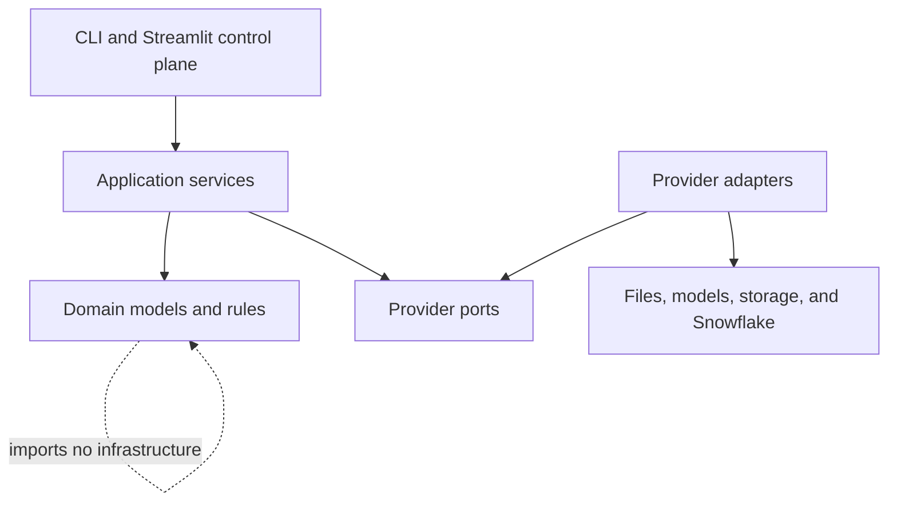
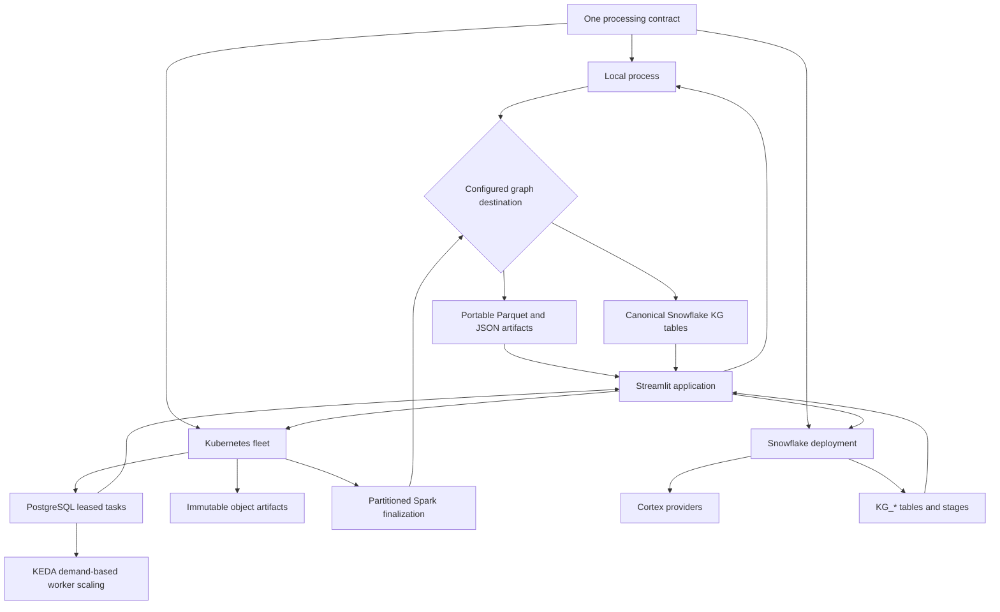

# Architecture

FlakeGraph separates graph-processing rules from providers and execution
infrastructure. This keeps local, fleet, and Snowflake runs consistent while
allowing each deployment to choose its own services.

## Boundaries

| Package | Responsibility |
| --- | --- |
| `domain/` | Documents, extraction observations, graph records, ontology, IDs, tasks, and finalization manifests |
| `ports/` | Narrow interfaces for files, OCR, extraction, LLMs, embeddings, caches, writers, task stores, and artifact stores |
| `application/` | Provider-neutral orchestration, grounding, resolution, graph assembly, quality checks, distribution, and inspection |
| `adapters/` | Concrete provider transports and persistence implementations |
| `config/` | Typed settings, provider discovery, validation, and preflight checks |
| `factories.py` | The composition root that maps configuration to adapters |
| `app/` | Python 3.11-compatible Streamlit control plane with local, Kubernetes, and Snowflake backends |

Domain and port modules do not import application or adapter modules. Provider
SDKs are imported only by adapters and the composition root.

## Processing Contract

```mermaid
flowchart LR
    source["Input files"] --> ocr["OCR and normalization"]
    ocr --> chunks["Document-bounded chunks and windows"]
    chunks --> context["Reusable document-context entities"]
    context --> entities["Grounded entity mentions"]
    entities --> relations["Grounded relations"]
    relations --> resolution["Corpus-wide identity resolution"]
    resolution --> graphOutput["Canonical nodes and edges"]
    graphOutput --> quality["Evidence and structural validation"]
    quality --> enrichment["Embeddings and communities"]
    enrichment --> writer["Versioned output"]
```

Extraction produces observations rather than final graph identities. Entity
mentions must refer to source chunks, and accepted relations must reference
accepted mention IDs and source evidence. Finalization then resolves identities
across the corpus, maps relation endpoints, merges repeated evidence, validates
the complete graph, and publishes output.

An ontology defines entity types, relation names, endpoint constraints, aliases,
and self-loop policy. Open ontologies allow grounded relation labels beyond the
declared vocabulary; closed ontologies reject them.

Quality errors such as dangling endpoints, duplicate canonical triples,
unapproved self-loops, invalid evidence spans, ontology violations, or incorrect
embedding dimensions can block publication. Advisory topology metrics remain in
the run report and explorer.

## Execution Modes

All modes use the same input, extraction, ontology, graph, and quality models.
Only orchestration and persistence differ.

The Streamlit application does not implement a second pipeline. Local and fleet
backends call the stable CLI contracts; the Snowflake backend uses the active
Snowpark session and canonical job/graph tables. This keeps the UI independently
deployable on Snowflake's Python runtime while the processing image retains its
own runtime and dependencies.

### Local

`KgProcessorPipeline` executes the complete corpus in one process. Provider
calls can still run concurrently, but graph finalization occurs within that
process. Local mode is the simplest environment for development, evaluation,
and moderate corpora.

### Kubernetes

The distributed planner creates preparation tasks per document and one final
barrier. Each preparation task creates a document-context task, which identifies
the ontology-declared focal entities once and then fans out bounded entity-window
tasks. A metadata-only barrier compacts one document entity inventory and creates
a second parallel relation-window wave. Workers pull compatible tasks from
PostgreSQL using renewable leases; they are not assigned fixed document
partitions. Immutable intermediate artifacts live in S3-compatible storage.

File discovery, source staging, and initial task insertion are streamed in
bounded batches. The production PostgreSQL adapter commits short `COPY` batches
while the run remains invisible in its planning state, so source uploads hold no
database transaction and submission memory depends on upload concurrency rather
than corpus size. Queue claims use indexed dependency counters; completing a
prerequisite decrements only its direct dependants instead of rescanning
successful tasks.

The final task has no dependency edge per document. It becomes ready only when
the run contains no unfinished non-final tasks, and it discovers completed stage
outputs by run and artifact kind. This keeps the coordination graph constant-size
at the final boundary and avoids serializing document completions on one shared
database row when a corpus contains hundreds of thousands of files.

KEDA queries dependency-ready queued work and active leases, stopping at each
pool's maximum useful demand rather than counting an arbitrarily large backlog.
It retains capacity for active leases and takes drained pools to zero. Spark
therefore receives node capacity after extraction without an operator changing
replicas or PostgreSQL repeatedly scanning millions of excess queue rows.

Spark finalization performs partitioned identity candidate generation,
resolution, self-loop policy enforcement, graph assembly, quality checks,
embeddings, and community analysis. Identity candidates are generated from
bounded lexical neighborhoods, so candidate cardinality grows linearly with
mentions rather than through a corpus-wide Cartesian comparison. Grounded
entities remain available even when no relation survives. Community detection
combines relation edges with a deterministic anchor-star projection of at most
30 entities per chunk. That projection preserves co-mention connectivity with
at most 29 temporary edges per chunk instead of materializing a quadratic
clique; these topology edges never become graph facts.

Complete source provenance is stored in partitioned evidence, entity-source,
and edge-observation tables. Node and edge rows also carry bounded source-ID
arrays for convenient inspection, but those denormalized arrays are not the
authoritative provenance store. Ranking before aggregation prevents one concept
that appears throughout a very large corpus from creating an unbounded Spark
group, while community co-mentions continue to use the complete evidence table.

Provider-backed identity decisions, description merges, and community reports
run in small request-sized Spark partitions. Executors reuse provider adapters,
HTTP connections, and local embedding models, issue a bounded number of calls
concurrently, and replenish capacity as calls finish. Eager checkpoints ensure
that downstream branches cannot replay provider calls. Publication records one
completed graph version, so readers never observe a partially finalized graph.
See [Kubernetes fleet deployment](kubernetes-fleet.md).

### Snowflake

Snowflake adapters provide stages, Cortex OCR/LLM/embeddings, cache tables,
leased job tables, and direct or staged graph writes. The container can run in
Snowpark Container Services, but locally or externally hosted providers may
also write to Snowflake through the same writer ports. See
[Snowflake setup](snowflake-setup.md).

## Adding A Provider

1. Implement the relevant protocol under `ports/` in a module under
   `adapters/<boundary>/`.
2. Register its public name and required capabilities in
   `config/provider_registry.py`.
3. Add typed configuration and validation in `config/settings.py` and
   `config/preflight.py`.
4. Wire construction in `factories.py`; provider selection must not enter the
   application or domain layers.
5. Add adapter contract tests, failure tests, and one configuration example when
   the provider introduces settings users must understand.

Provider adapters should return domain objects, avoid leaking SDK objects, delay
optional imports until the provider is selected, and redact credentials from
errors and diagnostics.

## Output

Local output and distributed exports share a table-oriented graph contract:
documents, chunks, nodes, edges, evidence, entity sources, communities,
community findings, traces, quality results, metrics, and a run report. Stable
IDs and source provenance make repeated writes and graph-version publication
idempotent.
