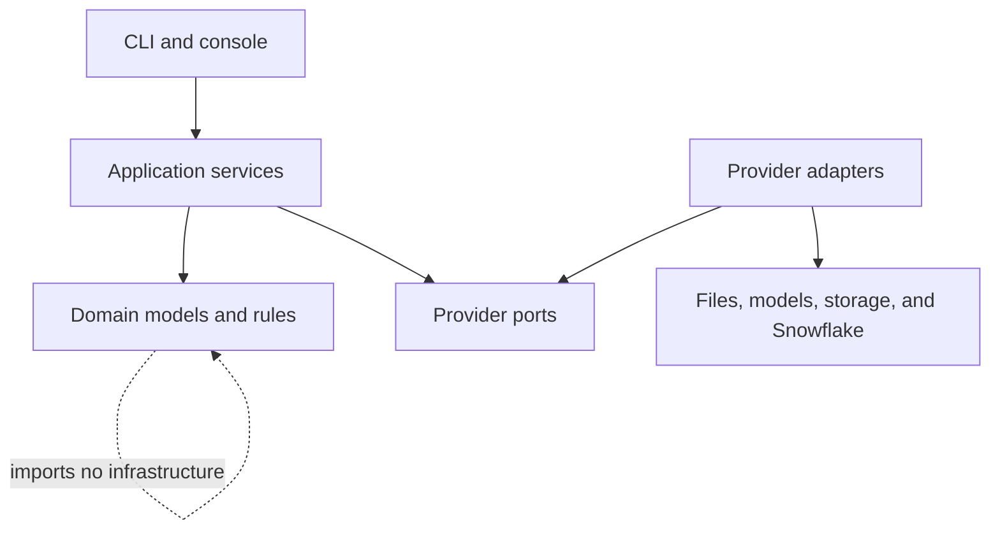
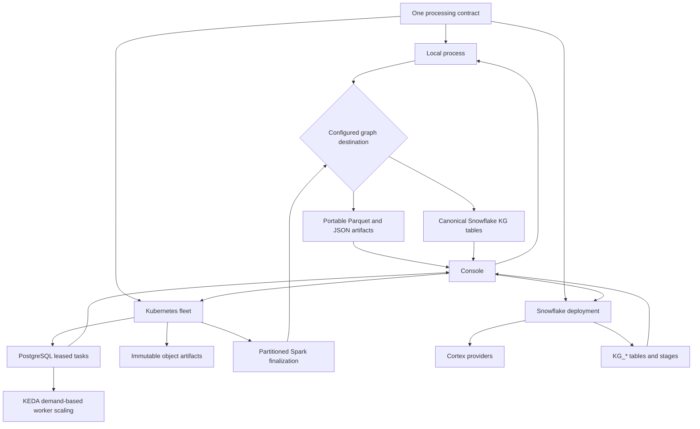

# Architecture

FlakeGraph separates graph-processing rules from providers and execution
infrastructure. This keeps local, fleet, and Snowflake runs consistent while
allowing each deployment to choose its own services.

## Boundaries

| Package | Responsibility |
| --- | --- |
| `domain/` | Documents, extraction observations, graph records, ontology, IDs, tasks, and finalization manifests |
| `ports/` | Narrow interfaces for files, OCR, extraction, LLMs, embeddings, caches, writers, task stores, and artifact stores |
| `application/` | Provider-neutral orchestration, grounding, resolution, graph assembly, quality checks, distribution, and inspection |
| `adapters/` | Concrete provider transports and persistence implementations |
| `config/` | Typed settings, provider discovery, validation, and preflight checks |
| `factories.py` | The composition root that maps configuration to adapters |
| `serving/` | HTTP services that put a priority-aware enforcement floor in front of a shared fleet |
| `react/` | Next.js console: the control plane, with local, Kubernetes, and Snowflake runtime modules that drive the CLI |

Domain and port modules do not import application or adapter modules. Provider
SDKs are imported only by adapters and the composition root.

## The Serving Contract

`serving/` is deliberately separate from the pipeline. It speaks wire formats
owned by other projects — the OpenAI chat contract and MinerU's `/file_parse` —
so that a fleet's inference and parsing planes hold the same guarantees whatever
engine or parser sits behind them.

Four invariants hold at every fleet size. Everything else is an implementation
detail an operator may swap.

1. **Consumers see one OpenAI-compatible URL** for inference and one HTTP
   endpoint for parsing. They never learn the topology behind either.
2. **Priority is a request field**, stamped at a trusted point and honoured by
   the engine. It is never a routing-layer concept.
3. **Everything is configured from environment variables and files** — never
   from cluster shape, node count, or discovered topology.
4. **Failure modes are safe by default**: an unknown caller is rejected, an
   unknown class is served last, and a misconfigured engine fails at startup
   rather than silently serving FIFO.

Hold these and the gateway, the placement layer, the engine, and the queue
backend all become replaceable without any consumer changing.

Those invariants describe a consumer that holds a key. People do not, so a
deployment publishes its services as hostnames under one domain behind a single
sign-in gate, and the applications behind it stop implementing identity one at
a time. The two audiences reach the same fleet by different routes: a browser
is sent to the gate, while the exact API paths that already authenticate their
own callers are routed past it, because an SDK holding a bearer token cannot
satisfy a browser sign-in. What the gate establishes then travels as a request
header, which is proof only for traffic that reached the application through
the ingress controller — so the control plane may read that identity in place
of authenticating its own callers only where a policy restricts who can open a
connection to it at all.

Note that the two planes order priority in opposite directions, and the
difference is not cosmetic. The serving bands follow vLLM, where a **lower**
value is served first and a missing value therefore means *highest* priority.
The pipeline's own task queue orders by `priority DESC`. Code that touches both
must be explicit about which queue it is talking to.

## Processing Contract

```mermaid
flowchart LR
    source["Input files"] --> ocr["OCR and normalization"]
    ocr --> chunks["Document-bounded chunks and windows"]
    chunks --> context["Reusable document-context entities"]
    context --> entities["Grounded entity mentions"]
    entities --> relations["Grounded relations"]
    relations --> resolution["Corpus-wide identity resolution"]
    resolution --> graphOutput["Canonical nodes and edges"]
    graphOutput --> quality["Evidence and structural validation"]
    quality --> enrichment["Embeddings and communities"]
    enrichment --> writer["Versioned output"]
```

Extraction produces observations rather than final graph identities. Entity
mentions must refer to source chunks, and accepted relations must reference
accepted mention IDs and source evidence. Finalization then resolves identities
across the corpus, maps relation endpoints, merges repeated evidence, validates
the complete graph, and publishes output.

An ontology defines entity types, relation names, endpoint constraints, aliases,
and self-loop policy. Open ontologies allow grounded relation labels beyond the
declared vocabulary; closed ontologies reject them. An entity type may be a
document-context type (found once per document), a `document_subject` (what a
document is or describes, which may be a relation's implicit source), or an
`identifier` (names that are codes or numbers); a relation type may carry
`quantities`, the values it states. A profile may name a `fallback_relation`
that keeps a statement whose own relation's type rules its entities break,
with the stated type recorded on the observation.

Quality errors such as dangling endpoints, duplicate canonical triples,
unapproved self-loops, invalid evidence spans, ontology violations, or incorrect
embedding dimensions can block publication. Advisory topology metrics remain in
the run report and explorer.

### Extraction Gaps

A window the model returns nothing for is ordinary: a title page or a table of
contents has no entities. A pass over a window where the model returns records
and validation rejects them all - a quote that is not verbatim in the text, a
relation the ontology forbids - is different: the text was read, something was
claimed about it, and none of it was kept from that pass. For an entity window
what the text names is absent; for a relation window its entities stand but no
relation from that pass does. Both finalizers derive these from the extraction
trace into a `discarded_windows` table (document, pages, pass, the rejected
count by reason, and the start of the window's text), the run report carries
the totals, and the console reports them per document beside the quality
gates. Every rejected record, gap or not, is listed in `rejected_records`
(reason, statement, types, quote), and the console lists them with the type
rules that turned the most relations away. A gap never fails a run; it is stated. A
corpus of hundreds of documents is not lost to one brochure title slide, and
a reader is told exactly which pages the graph does not cover.

### Community Detection

Communities are detected over canonical relation edges plus a weak, bounded
co-mention projection: entities that share a chunk are linked with a small
weight so sparse but related regions cluster, and the projection is capped at
30 entities per chunk so a broad chunk cannot manufacture a dense clique.
Those topology edges never become graph facts.

The local and Spark engines partition that graph differently, and the parity
contract between them is deliberately about shapes rather than identical
partitions: both produce communities with stable ids derived from their
sorted membership, a hierarchy of bounded child communities for oversized
groups, and the same structural rating rule. The local engine runs a seeded
modularity partition. The default is NetworkX's Louvain
(`graph.community_algorithm: louvain`), chosen because it ships with a
permissive licence; Leiden (`leiden`) gives the same contract with somewhat
better-connected communities but depends on the GPL-licensed `igraph` and
`leidenalg` packages, so it is an opt-in extra (`flakegraph[leiden]`) and
installing it changes the licence terms of the combined installation. Both are
run over vertices and edges in sorted order with a fixed seed, so repeated runs
of the same graph publish the same community ids. Oversized communities are
recursively split at a higher resolution, to a bounded depth. The Spark engine
uses GraphFrames label propagation over the same relation-plus-projection
graph, which suits partitioned execution.

The default changed from Leiden to Louvain when the package was prepared for
release under Apache-2.0. On the bundled fixtures the two agree; on a real
corpus the partitions differ in detail, so graphs built before and after the
change should not be compared community by community.

## Execution Modes

All modes use the same input, extraction, ontology, graph, and quality models.
Only orchestration and persistence differ.

The console does not implement a second pipeline. Local and fleet
backends call the stable CLI contracts; the Snowflake backend reads and writes
the canonical job and graph tables through a Snowflake connection. The console
is a separate Next.js application with its own runtime and dependencies, so the
processing image carries none of it and either can be deployed without the
other.

### Local

`KgProcessorPipeline` executes the complete corpus in one process. Provider
calls can still run concurrently, but graph finalization occurs within that
process. Local mode is the simplest environment for development, evaluation,
and moderate corpora.

### Kubernetes

The distributed planner creates preparation tasks per document and one final
barrier. Each preparation task creates a document-context task, which identifies
the ontology-declared focal entities once and then fans out bounded entity-window
tasks. A metadata-only barrier compacts one document entity inventory and creates
a second parallel relation-window wave. Workers pull compatible tasks from
PostgreSQL using renewable leases; they are not assigned fixed document
partitions. Immutable intermediate artifacts live in S3-compatible storage.

File discovery, source staging, and initial task insertion are streamed in
bounded batches. The production PostgreSQL adapter commits short `COPY` batches
while the run remains invisible in its planning state, so source uploads hold no
database transaction and submission memory depends on upload concurrency rather
than corpus size. Queue claims use indexed dependency counters; completing a
prerequisite decrements only its direct dependants instead of rescanning
successful tasks.

The final task has no dependency edge per document. It becomes ready only when
the run contains no unfinished non-final tasks, and it discovers completed stage
outputs by run and artifact kind. This keeps the coordination graph constant-size
at the final boundary and avoids serializing document completions on one shared
database row when a corpus contains hundreds of thousands of files.

KEDA queries dependency-ready queued work and active leases, stopping at each
pool's maximum useful demand rather than counting an arbitrarily large backlog.
It retains capacity for active leases and takes drained pools to zero. Spark
therefore receives node capacity after extraction without an operator changing
replicas or PostgreSQL repeatedly scanning millions of excess queue rows.

Spark finalization performs partitioned identity candidate generation,
resolution, self-loop policy enforcement, graph assembly, quality checks,
embeddings, and community analysis. Identity candidates are generated from
bounded lexical neighborhoods, so candidate cardinality grows linearly with
mentions rather than through a corpus-wide Cartesian comparison. Grounded
entities remain available even when no relation survives. Community detection
combines relation edges with a deterministic anchor-star projection of at most
30 entities per chunk. That projection preserves co-mention connectivity with
at most 29 temporary edges per chunk instead of materializing a quadratic
clique; these topology edges never become graph facts.

Complete source provenance is stored in partitioned evidence, entity-source,
and edge-observation tables. Node and edge rows also carry bounded source-ID
arrays for convenient inspection, but those denormalized arrays are not the
authoritative provenance store. Ranking before aggregation prevents one concept
that appears throughout a very large corpus from creating an unbounded Spark
group, while community co-mentions continue to use the complete evidence table.

Provider-backed identity decisions, description merges, and community reports
run in small request-sized Spark partitions. Executors reuse provider adapters,
HTTP connections, and local embedding models, issue a bounded number of calls
concurrently, and replenish capacity as calls finish. Eager checkpoints ensure
that downstream branches cannot replay provider calls. Publication records one
completed graph version, so readers never observe a partially finalized graph.
See [Kubernetes fleet deployment](kubernetes-fleet.md).

### Snowflake

Snowflake adapters provide stages, Cortex OCR/LLM/embeddings, cache tables,
leased job tables, and direct or staged graph writes. The container can run in
Snowpark Container Services, but locally or externally hosted providers may
also write to Snowflake through the same writer ports. See
[Snowflake setup](snowflake-setup.md).

## Adding A Provider

1. Implement the relevant protocol under `ports/` in a module under
   `adapters/<boundary>/`.
2. Register its public name and required capabilities in
   `config/provider_registry.py`.
3. Add typed configuration and validation in `config/settings.py` and
   `config/preflight.py`.
4. Wire construction in `factories.py`; provider selection must not enter the
   application or domain layers.
5. Add adapter contract tests, failure tests, and one configuration example when
   the provider introduces settings users must understand.

Provider adapters should return domain objects, avoid leaking SDK objects, delay
optional imports until the provider is selected, and redact credentials from
errors and diagnostics.

## Output

Local output and distributed exports share a table-oriented graph contract:
documents, chunks, nodes, edges, evidence, entity sources, communities,
community findings, discarded windows, traces, quality results, metrics, and a
run report. A document row says what the file is (`kind`: document, dataset, or
image), where it sits (`folder`, relative to the source root), a dataset's
`summary`, and its `related_file_ids`; an edge observation
carries the `quantities` its relation states. Stable
IDs and source provenance make repeated writes and graph-version publication
idempotent.
