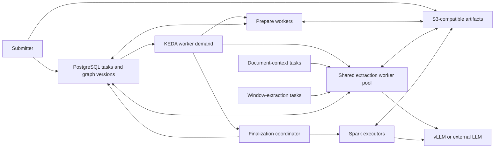
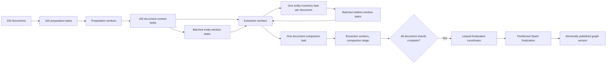

# Kubernetes Fleet Deployment

FlakeGraph uses Kubernetes for scheduling, PostgreSQL for durable task leases,
KEDA for queue-driven worker scaling, S3-compatible storage for immutable
artifacts, and Spark for graph-wide finalization. Providers may run in worker
containers, in chart-managed vLLM pods, or behind external endpoints.



## Components

| Component | Owner |
| --- | --- |
| Prepare, context/extract, and finalize workers | FlakeGraph Helm chart |
| Queue-driven scale-to-zero | KEDA PostgreSQL scaler |
| Spark driver, executor template, and RBAC | FlakeGraph Helm chart |
| Engine pods, each an authenticating sidecar plus one pinned engine | Optional FlakeGraph StatefulSet |
| LiteLLM gateway: keys, budgets, spend, model access | FlakeGraph Helm chart |
| Envoy and the endpoint picker: prefix-aware placement | FlakeGraph Helm chart |
| OCR shim and the `mineru-api` pool | FlakeGraph Helm chart |
| PostgreSQL | Managed service or optional CloudNativePG cluster |
| S3-compatible storage | External managed or self-hosted service |
| Embedding and external model services | Selected provider deployment |
| GPU drivers and NVIDIA device plugin | Cluster administrator |

FlakeGraph does not install object storage or hide its lifecycle inside the
application chart. PostgreSQL stores small coordination records; source bytes,
stage shards, and graph tables move through object storage.

## Work Distribution

Workers pull compatible tasks rather than receiving fixed document partitions.
For 100 documents, submission creates 100 preparation tasks. Each preparation
result adds one context task; that task identifies the source document once and
then adds extraction tasks for its actual body windows. Context and window tasks
share the extraction worker pool, and idle workers continuously claim the next
eligible item.



`prepare_document` performs OCR, normalization, and chunking.
`extract_document_context` identifies ontology-declared focal entities from
bounded front matter and removes a validated bibliography suffix.
`extract_entity_window` produces grounded mentions. A bounded lease may contain
several logical windows, whose provider calls remain independently parallel.
`compact_entity_inventory` deduplicates every mention for the document and fans
out `extract_relation_window` tasks. Each relation window receives that complete
inventory, so it can connect endpoints discovered elsewhere in the document.
`compact_document` assembles relation observations and the inventory into one
immutable document shard. Both compaction stages perform no model inference.
`finalize_graph` starts Spark jobs for identity resolution, graph
assembly, connected-entity selection, quality checks, embeddings, communities,
and versioned Parquet output. Its leased coordinator persists one bounded
phase-progress record, so status clients can show the current operation and
table-write counter without scanning Spark logs or graph-sized task data.

Task claims use renewable PostgreSQL leases. A stopped worker's task becomes
claimable after lease expiry, up to the configured attempt budget. Finalization
uses the complete corpus because independent document-level graphs cannot
resolve identities or communities consistently.

The default five-minute task lease is renewed once per minute and does not cap
task duration. It bounds hard-node-loss recovery while allowing long OCR and
Spark work to continue for as long as its worker remains healthy.

KEDA queries dependency-ready queued tasks and active leases for each worker
pool. The query stops once it reaches that pool's configured maximum useful
demand: counting the remaining millions of tasks cannot request more replicas
and would only load PostgreSQL. Active leases remain in the bounded demand, so
KEDA can remove idle pods without dropping the capacity that owns in-flight
work. After extraction drains, the prepare and extract pools reach zero and
Spark executors receive the fleet's CPU and memory. Spark has higher scheduling
priority than workers as a fallback during the short autoscaler convergence
window; model servers remain higher priority than both.

## Prerequisites

- Kubernetes 1.34 or newer with reliable cross-node networking and DNS
- KEDA 2.20.1
- PostgreSQL 14 or newer
- S3-compatible storage reachable by workers and Spark executors
- Worker and Spark images for every node architecture
- NVIDIA drivers and device plugin when local GPU providers are enabled
- A registry or mirror reachable by every node
- Provider and storage credentials stored in Kubernetes Secrets

For high availability, use at least three control-plane/database members and
spread control-plane, DNS, database, model, and storage replicas across failure
domains. Kubernetes server nodes remain ordinary schedulable workers unless an
operator deliberately taints them, so control-plane redundancy does not remove
three DGX systems from the compute pool.

### Create A K3s Cluster

Kubernetes installation is infrastructure ownership rather than a FlakeGraph
runtime concern. For a new bare-metal fleet, K3s provides a compact supported
path. Use its current
[requirements](https://docs.k3s.io/installation/requirements) and
[embedded-etcd HA](https://docs.k3s.io/datastore/ha-embedded) guides as the
source of truth. The production shape is:

1. Give every host a unique stable name and address, synchronize time, and make
   the documented Kubernetes, etcd, DNS, and overlay-network ports reachable.
2. Put a stable DNS name or load balancer in front of three K3s server nodes.
3. Initialize the first server with embedded etcd, then join two more servers.
4. Join the remaining hosts as agents. Do not taint the three servers when all
   DGX systems should also execute FlakeGraph workloads.
5. Install the NVIDIA GPU Operator or a validated equivalent device-plugin and
   container-runtime integration.

The commands below show the K3s topology. Keep the token in a secret manager,
pin `INSTALL_K3S_VERSION` to the release validated by the site, and replace the
stable API endpoint rather than using one server's transient address:

```bash
# First of three server nodes
curl -sfL https://get.k3s.io | \
  K3S_TOKEN="$K3S_TOKEN" INSTALL_K3S_VERSION="$K3S_VERSION" \
  sh -s - server --cluster-init --tls-san "$K3S_API_HOST"

# Second and third server nodes
curl -sfL https://get.k3s.io | \
  K3S_TOKEN="$K3S_TOKEN" K3S_URL="https://$K3S_API_HOST:6443" \
  INSTALL_K3S_VERSION="$K3S_VERSION" sh -s - server \
  --tls-san "$K3S_API_HOST"

# Every remaining worker node
curl -sfL https://get.k3s.io | \
  K3S_TOKEN="$K3S_TOKEN" K3S_URL="https://$K3S_API_HOST:6443" \
  INSTALL_K3S_VERSION="$K3S_VERSION" sh -
```

Private-overlay deployments may additionally need K3s `node-ip`, advertised
address, and Flannel interface settings. Those depend on the chosen network and
must be identical in intent across every host; verify cross-node pod, service,
DNS, API-server, and etcd connectivity before installing FlakeGraph.

Use capability labels rather than hostnames in public values files:

```bash
kubectl label node <gpu-node> flakegraph.io/node-class=nvidia-spark
kubectl label node <cpu-node> flakegraph.io/node-class=cpu-control
```

### Scripted Bring-Up For NVIDIA DGX Spark Nodes

`deploy/spark/` automates the topology above for GB10 hardware, and is worth
reading even if the fleet runs on something else, because two of the problems it
solves are properties of corporate networks rather than of this hardware.

| Script | Runs as | Does |
| --- | --- | --- |
| `stage-artifacts.sh` | operator workstation | Fetches k3s, verifies its published SHA-256, copies it to the node |
| `bootstrap-node.sh` | root, on the node | Container runtime, NVIDIA runtime, k3s, node labels |
| `install-cluster.sh` | operator, on the node | Device plugin, KEDA, CloudNativePG, object storage |

`bootstrap-node.sh --role server` starts embedded etcd rather than the k3s
default, because a default single-node server uses SQLite and can never gain a
second control-plane node — a decision that cannot be revisited later without
rebuilding the cluster. Further nodes take `--role agent`. It is idempotent, so
re-running it verifies a node rather than disturbing it.

Two traps it exists to handle:

**A CIS-hardened image may blacklist `overlay`.** Containers cannot run without
it; both Docker's `overlay2` driver and the containerd k3s embeds mount it for
every layer. Worse, a blacklist written as `install overlay /bin/true` makes
`modprobe overlay` **exit successfully while loading nothing**. Verify with
`grep -w overlay /proc/filesystems`, never with `modprobe`'s exit status.

**A TLS-inspecting network needs its root CA on every node.** Where a proxy
re-signs certificates, a host without those roots fails every download in a way
that reads as a firewall block — transfers stop at zero bytes and return a
redirect to the proxy's own page. Install the roots before concluding that a host
is blocked. Containers carry their own trust stores and need the certificate
copied in separately, and Python is affected worse than most: `curl` verifies
against the system store while `httpx` and `requests` verify against `certifi`,
so the same URL succeeds under one and fails under the other.

## Build Images

A mixed fleet needs both `linux/amd64` and `linux/arm64` manifests:

```bash
docker buildx create --name flakegraph-builder --use
docker buildx build \
  --platform linux/amd64,linux/arm64 \
  --tag registry.example.com/flakegraph:0.1.0 \
  --push .

docker buildx build \
  --platform linux/amd64,linux/arm64 \
  --file Dockerfile.spark \
  --tag registry.example.com/flakegraph-spark:0.1.0 \
  --push .
```

Pin the resulting image digests in production values.

## PostgreSQL And Storage

For an external database, set `database.secretName` and `database.secretKey` to
a Secret containing a PostgreSQL URI. To use CloudNativePG, install its pinned
operator chart and set `database.cloudNativePG.enabled=true`; the FlakeGraph
chart then creates the declared cluster and uses its application Secret.

Set these object-storage values:

- `artifactStorage.uri`
- `artifactStorage.endpointUrl`
- `artifactStorage.existingSecret`
- `artifactStorage.region`

Before processing data, test put, get, checksum verification, and delete from
both the worker and Spark images. Back up PostgreSQL and object storage as one
system: PostgreSQL contains task/version metadata and object storage contains
the referenced payloads.

### Capacity Sizing

Size PostgreSQL for durable coordination records, indexes, retries, and retained
run versions rather than source-file bytes. A useful first estimate is:

```text
database capacity = projected live metadata x 2 for indexes x 2 for operating headroom
```

Measure `pg_total_relation_size` after a representative sample before loading the
complete corpus. Keep at least 50% free during a run so PostgreSQL can vacuum,
build indexes, and absorb retry or version overlap. The CloudNativePG profile
therefore starts at 100Gi; increase it for corpora whose representative sample
projects beyond 50Gi of live tables and indexes.

Object storage holds source documents, prepared OCR, extraction artifacts, and
partitioned graph tables. Project it independently from a representative sample,
include every retained graph version, and apply the storage service's replication
factor. Object-store capacity commonly exceeds database capacity by an order of
magnitude for PDF-heavy corpora.

## Configure And Install

Keep site-specific values, endpoints, and Secret references outside Git under
the ignored `deploy/private/` directory:

```bash
helm repo add kedacore https://kedacore.github.io/charts
helm upgrade --install keda kedacore/keda \
  --namespace keda \
  --create-namespace \
  --version 2.20.1 \
  --set operator.replicaCount=2 \
  --set metricsServer.replicaCount=2 \
  --set webhooks.replicaCount=2 \
  --wait

cp deploy/examples/k3s-spark-values.yaml deploy/private/fleet-values.yaml
cp configs/app-defaults.yaml deploy/private/fleet-config.yaml

helm upgrade --install flakegraph deploy/helm/flakegraph \
  --namespace flakegraph \
  --create-namespace \
  --values deploy/private/fleet-values.yaml \
  --set-file config.content=deploy/private/fleet-config.yaml \
  --set-file ontology.content=configs/ontologies/general.yaml \
  --wait
```

The release is not reported ready until an idempotent database-bootstrap Job
has validated the mounted processing configuration, provider credentials,
provider binaries, and ontology, then applied the coordination schema used by
workers and KEDA. A missing credential, invalid provider setup, unreachable
database, or incompatible schema therefore fails the Helm operation instead of
leaving a superficially installed but inert worker fleet. Paths supplied only by
worker data volumes are intentionally deferred because the bootstrap hook does
not mount corpus or output storage.

Provider Secrets use an explicit environment-variable allowlist. Keep provider
and model identity in the mounted config, and map only credentials from the
Secret:

```yaml
providerSecret:
  name: flakegraph-providers
  optional: false
  env:
    - name: KG_LLM_API_KEY
      key: KG_LLM_API_KEY
      optional: false
    - name: KG_EMBED_API_KEY
      key: KG_EMBED_API_KEY
      optional: true
    - name: KG_SNOWFLAKE_PASSWORD
      key: KG_SNOWFLAKE_PASSWORD
      optional: true
    - name: KG_SNOWFLAKE_OAUTH_TOKEN
      key: KG_SNOWFLAKE_OAUTH_TOKEN
      optional: true
```

The chart never imports a whole Secret with `envFrom`, so an unrelated key such
as `KG_LLM_MODEL` or `KG_EMBED_MODEL` cannot silently replace reviewed YAML.
The Snowflake entries are optional until a submitted run selects Snowflake as its
output. The final task carries only database, schema, stage, and credential-key
names; the claiming worker resolves the credential value from this Secret.

Use the same processing config for submission and workers. Worker identity,
eligible stages, replica counts, and lease timing may differ; extraction,
ontology, model, and graph semantics must match the submitted run.

The chart creates independent preparation, extraction, and finalization
Deployments plus one KEDA `ScaledObject` per pool. PostgreSQL remains the source
of truth; KEDA only adjusts capacity and never owns task state. For an external
database, the URI in `database.secretName` must contain a fully qualified host
reachable from the KEDA namespace. The CloudNativePG profile configures its
fully qualified service automatically.

## Serving Plane

Set `modelServing.enabled=true` to run one pinned engine per StatefulSet replica.
Three classes of consumer share that fleet: interactive applications, the batch
extraction pipeline, and developer tooling. All three take one path.

```
  interactive apps ─┐
  batch pipeline   ─┼─→ LiteLLM ─→ Envoy + picker ─→ [ sidecar → engine ] × N
  developer tools  ─┘   keys        prefix-aware       enforcement floor
                        budgets     placement
                        spend

  consumers ─→ OCR shim (auth · priority queue · admission) ─→ mineru-api pool
```

### Queue-jump, never evict

Interactive work waits for a running batch request to finish, then goes first. A
running request is never preempted and a sequence slot is never held empty, so
compute already paid for is never discarded.

`--scheduling-policy priority` orders the *waiting* queue on `(priority,
arrival_time)`. vLLM has no waiting-to-running preemption, which for this policy
is the desired behaviour rather than a limitation: a high-priority arrival goes
to the head of the queue and takes the next slot to free.

Interactive wait is therefore bounded by how long a batch request runs, not by
scheduling. Expected wait is roughly `D / N`, for batch duration `D` across `N`
concurrent slots, which gives two levers:

- **`llm.max_output_tokens`** shortens `D`. This is the primary latency control.
- **`modelServing.server.maxNumSeqs`** raises `N`, so slots free more often.

### Priority is stamped, never claimed

Each engine binds `127.0.0.1` and a sidecar owns the only exposed port. The
sidecar authenticates the caller, maps the key to a consumer class, strips any
client-supplied `priority`, and stamps the server's band before forwarding.

The stamp is unconditional because vLLM reads a missing `priority` as `0`, which
is its *highest* band — an unstamped request would be promoted, not dropped. For
the same reason an unrecognised class resolves to the band served last.

`/health` and `/metrics` pass through unauthenticated: the kubelet probes the
first and the endpoint picker scores replicas on the second, and neither runs
inference. Adapter-management paths are refused outright.

Two Secrets carry the vocabulary, and they must agree:

| Secret | Key | Holds |
| --- | --- | --- |
| `modelServing.sidecar.keySecret` | `serving-keys.json` | A JSON object mapping each bearer key to a consumer class |
| | `SIDECAR_KEY_INTERACTIVE` / `_DEV` / `_BATCH` | The same key values, read by LiteLLM as environment variables |

LiteLLM presents a different upstream key per model alias, so **priority class is
which alias a virtual key may call**. Restrict each virtual key to one alias and
the mapping cannot be forged: nothing is injected into a request body, and the
sidecar would strip it if it were.

### Sizing, as a formula

`maxNumSeqs` cannot be a constant — it depends on the model, its quantisation,
the GPU, and the expected context:

```
kv_bytes_per_token = 2 × n_kv_heads × head_dim × n_attention_layers × dtype_bytes
recurrent_per_seq  = n_recurrent_layers × state_bytes_per_layer × slots_per_seq
bytes_per_sequence = kv_bytes_per_token × expected_context + recurrent_per_seq
kv_budget          = (device_memory × gpu_memory_utilization) − weights − overhead
max_concurrent     = kv_budget ÷ bytes_per_sequence

set max_num_seqs  <  max_concurrent
```

The middle line matters on a hybrid checkpoint. The reference model interleaves
16 full-attention layers with 48 linear-attention ones, and the latter hold a
fixed recurrent state per sequence that vLLM pages beside the KV cache — it says
so at startup by raising the attention block size until the attention page is at
least as large as the mamba page. That cost does not shrink with a shorter
context, so charging only per-token bytes overstates concurrency at every
context length.

That last line is load-bearing. vLLM *does* preempt a running request when it
cannot allocate KV blocks, and it evicts the lowest-priority victim — batch work,
mid-flight, against the policy above. Sizing so the sequence limit binds first
keeps that path cold. The sidecar recomputes this at startup from
`modelServing.sizing` and refuses to serve a configuration that crosses it.

Check a configuration before deploying it:

```bash
flakegraph serving sizing --kv-heads 4 --head-dim 256 --attention-layers 16 \
  --weights-gib 21.81 --device-memory-gib 119.2 --max-num-seqs 24
```

The default profile serves `unsloth/Qwen3.8-27B-NVFP4` at a pinned revision with
an FP8 KV cache, FlashInfer attention, Marlin MoE, chunked prefill, prefix
caching, and asynchronous scheduling. Speculative decoding is off: it conflicts
with `--async-scheduling` and forfeits much of the reusable prefix on
hybrid-cache models. Set `modelServing.server.speculativeTokens` above zero only
behind a benchmark on the hardware you are deploying to.

`gpuMemoryUtilization` defaults to `0.50`. On a unified-memory part the same
physical pool holds the operating system, the kubelet, workers, Spark executors,
and storage, and CUDA allocations are not fully represented in pod memory
metrics. This is not a conservative guess: `0.70` on GB10 hardware starved sshd
and the cluster API and took the node off the network for hours, while ICMP kept
answering. Raise it only on a node doing nothing but inference, raise
`maxNumSeqs` with it, and confirm with the sizing command above first.

### Placement

Envoy and the endpoint picker share a pod, so the `ext_proc` call stays on
loopback. Envoy terminates the connection, the picker names a replica in
`x-gateway-destination-endpoint`, and an `ORIGINAL_DST` cluster routes there.
The picker scores queue depth, KV utilisation, and prefix affinity, weighted by
`gateway.placement.endpointPicker.scorerWeights`; with
`modelServing.kvEvents.enabled` it indexes what each replica actually holds
rather than hashing prefixes.

The picker selects engine pods by label rather than through an `InferencePool`,
so no Gateway API Inference Extension CRDs are required.

Placement never changes what the engine sees. The body is forwarded verbatim, so
the priority the sidecar stamps is unaffected by where the request lands.

### Document parsing

`mineru-api` answers **409 when it is busy**, and FlakeGraph's HTTP transport
does not retry, so a saturated pool would drop documents rather than slow down.
The shim holds that work instead: it authenticates, orders waiting requests by
priority in PostgreSQL, and admits only what the pool can take.

The queue is in PostgreSQL rather than process memory because ordering has to
hold *across* shim replicas — two replicas each ordering their own callers
correctly still serve them in the wrong order relative to each other. Tracking
how much of the pool is busy is what admission control needs anyway, which makes
least-loaded dispatch free.

The shim resolves the parsing pool by one DNS name, so `documentParsing.mineru`
can autoscale underneath it without a configuration change.

Note that the parsing bands follow the serving convention — **lower is served
first** — while the pipeline's own task queue orders by `priority DESC`. They are
different queues; the shim shares its vocabulary with the sidecar.

### Run priority

`distributed.priority_offset` selects the band a whole run is submitted at. The
stage ladder occupies 0-20, so `0` keeps a run in the bulk band and `1000` puts
it ahead of any backlog. The value must be `0` or at least `1000`: an offset
between the bands would interleave an urgent run with bulk work, which looks
correct until a large corpus arrives.

KEDA gets one trigger per band, so a small urgent run can scale a drained pool
up on its own rather than waiting for a bulk backlog to justify the capacity.
Workers then claim by priority, which is what serves the urgent run first.

### Verifying a fleet

```bash
kubectl -n flakegraph rollout status statefulset/flakegraph-flakegraph-vllm --timeout=60m
kubectl -n flakegraph get pods,pvc,service -l app.kubernetes.io/instance=flakegraph

# Priority cannot be forged: a batch key asking for band 0 is rewritten.
kubectl -n flakegraph logs flakegraph-flakegraph-vllm-0 -c vllm | grep -i 'priority'

# Nothing is evicted mid-flight. This must stay at zero under mixed load.
kubectl -n flakegraph exec flakegraph-flakegraph-vllm-0 -c sidecar -- \
  curl -s localhost:8000/metrics | grep vllm:num_preemptions_total
```

Change one image, model revision, context limit, or concurrency control at a
time and run a gold-set canary before promotion.

## Submit And Export

From an environment that can reach PostgreSQL and the configured source:

```bash
export KG_DISTRIBUTED_DATABASE_URL='postgresql://...'

uv run flakegraph distributed init --config configs/your-config.yaml
uv run flakegraph distributed submit --config configs/your-config.yaml
uv run flakegraph distributed status --run-id <run-id> --config configs/your-config.yaml
```

Every worker emits one `worker_ready` JSON event containing its eligible stages,
provider/model identities, and semantic `config_digest`; endpoints and credentials
are omitted. `distributed status` compares the caller's digest with the run and
reports machine-readable diagnostics. `CONFIG_DIGEST_MISMATCH` means those
settings cannot claim the run. `QUEUED_WORK_NOT_ADVANCING` means queued work has
not been claimed for at least 60 seconds; inspect pod readiness and confirm that
an eligible worker advertises the run digest.

After completion:

```bash
uv run flakegraph distributed export \
  --run-id <run-id> \
  --output out/fleet-run \
  --config configs/your-config.yaml

uv run flakegraph inspect html --output out/fleet-run --open
```

The submitter stores source bytes in the artifact store, so workers do not need
the submitter's filesystem mount.

## Scaling

Set capacity ceilings once; KEDA handles ordinary scale-up, scale-down, and the
handoff to Spark. The shared extraction pool claims one document-context task
per document, then an entity-window wave, an inventory barrier, and an
independent relation-window wave. Both window waves are dynamically claimed;
bounded task packs may process several logical windows concurrently. A worker
owns one lease at a time, while `graph.extraction_parallelism` bounds provider
calls inside that lease.

For local vLLM, provider capacity is approximately model replicas multiplied by
`modelServing.server.maxNumSeqs`. Size the extraction ceiling as provider capacity
divided by `graph.extraction_parallelism`, rounding down to avoid a permanent
overload. Increase sequence capacity, batched-token capacity, and context length
separately while observing queue depth, generation throughput, GPU utilization,
and memory. Context and compaction tasks use less model concurrency, so KEDA may
temporarily schedule below the ceiling without leaving sustained extraction work
idle.

Spark finalization scales with executor instances and cores. The finalization
coordinator remains one leased task, but graph rows stay partitioned across
executors and object storage. Provider-backed phases use several small work units
per executor slot and bounded in-partition concurrency, allowing Spark to keep
assigning work when individual model requests have variable latency. The default
three-minute LLM request timeout prevents one stalled call from indefinitely
serializing a stage; raise `llm.timeout_seconds` only for a measured provider that
needs a longer decode window. Small corpora may still be dominated by model
startup, the final extraction straggler, Spark startup, and atomic publication.

Executors must be able to load the embedding model without reaching the network,
and the failure when they cannot is unusually hard to read: the stage does not
error, it stops advancing. Finalization constructs the encoder once per
partition, so a model resolution that raises inside a Spark task is retried by
the task, and a job that is failing every attempt looks exactly like a job that
is working slowly.

The most reliable arrangement is to mount the model as a plain directory and
name it by path, which involves no model-hub code at all:

```yaml
embedding:
  provider: sentence_transformers
  model: /mnt/models/all-MiniLM-L6-v2   # a path, not a hub identifier

extraEnv:
  # Any accidental hub lookup then fails at once instead of retrying.
  - {name: HF_HUB_OFFLINE, value: "1"}
  - {name: TRANSFORMERS_OFFLINE, value: "1"}
extraVolumes:
  - {name: models, persistentVolumeClaim: {claimName: flakegraph-models}}
extraVolumeMounts:
  - {name: models, mountPath: /mnt/models, readOnly: true}
```

Produce that directory with `SentenceTransformer(name).save(path)`. Copying a
populated hub cache between machines is less dependable than it looks: a cache
written by one `huggingface_hub` version can satisfy `snapshot_download(...,
local_files_only=True)` and still not satisfy the loader that reads it.

The embedding model is part of the compatibility contract, so this path must be
identical in the deployed configuration and in every submitted run, or no worker
claims the run.

`extraVolumes`, `extraVolumeMounts`, and `extraEnv` reach worker pods and Spark
executors alike, because executors run the same application code. Use a
`ReadWriteMany` volume rather than a `hostPath` on any fleet larger than one
node — a `hostPath` silently resolves to an empty directory on every node that
was not the one staged.

Executors strongly prefer distinct topology domains but may co-locate if a node
is unavailable, preventing a temporary capacity reduction from leaving the
entire finalization job unschedulable.

For a homogeneous 20-node GPU fleet with one four-sequence vLLM replica per
node, the site-specific values are limited to capacity declarations:

```yaml
modelServing:
  replicas: 20

workers:
  prepare:
    autoscaling:
      # Four four-core OCR workers fit beside vLLM on each 20-core GB10 node.
      maxReplicas: 80
  extract:
    autoscaling:
      # 20 replicas * 4 sequences / 2 calls per extraction task.
      maxReplicas: 40

spark:
  executorInstances: 20
```

The bundled CloudNativePG profile reserves 300 database sessions for these
worker ceilings plus KEDA, Spark, and operator traffic. When using an external
PostgreSQL service, provide an equivalent direct-connection budget or place a
supported transaction-mode pooler in front of it; do not scale worker pods beyond
the database service's connection capacity.

Use node labels and resource requests to describe heterogeneous fleets. Do not
encode hostnames or split document lists per machine; all workers claim from the
same queue, and one slow document cannot strand an assigned partition.

Before the first production corpus, validate that all expected nodes are Ready,
all GPUs are allocatable, model replicas are spread, ScaledObjects are healthy,
and no Spark executor is permanently Pending:

```bash
kubectl get nodes
kubectl get nodes -o json | jq -r \
  '.items[] | [.metadata.name, .status.allocatable["nvidia.com/gpu"]] | @tsv'
kubectl -n flakegraph get statefulset,pod -l app.kubernetes.io/component=model-serving -o wide
kubectl -n flakegraph get scaledobject,hpa
kubectl -n flakegraph describe scaledobject
```

Run a representative canary through OCR, extraction, finalization, export, and
gold-set evaluation after every Kubernetes, driver, model, provider, image, or
chart upgrade. Promote the exact image digests and values only after the canary
and the recovery drill below succeed.

## Recovery

- `distributed status` shows bounded stage counts, configuration compatibility,
  and stalled-queue diagnostics. Add `--include-tasks` for attempts, leases,
  errors, and outputs of individual tasks.
- `kubectl get scaledobject,hpa -n flakegraph` shows worker demand and capacity.
- `distributed cancel` stops unfinished work without deleting successful artifacts.
- `distributed retry --run-id <run-id>` requeues terminally failed tasks after
  the underlying provider, configuration, or storage issue is corrected.
- Worker and executor loss is recovered through task leases or Spark partition
  recomputation; incomplete finalization never publishes a graph version.
- Set pod termination grace longer than the task lease when graceful completion
  is preferred over lease recovery.

Validate recovery by deleting workers during extraction, restarting the
database primary, stopping a provider replica, and deleting a Spark executor
during finalization. Use non-sensitive canary data and confirm that retries do
not create duplicate successful outputs.

For unattended operation, alert on terminal run failures, tasks nearing their
attempt limit, expired leases, KEDA scaler errors, unschedulable pods, database
replica health, object-store errors, model readiness, GPU memory pressure, and
Spark executor loss. Worker loss is expected and recoverable; a terminal task
failure is an operator-visible outcome, never an indefinitely hung run.

The application-layer contracts behind the deployment are described in
[Architecture](architecture.md).
