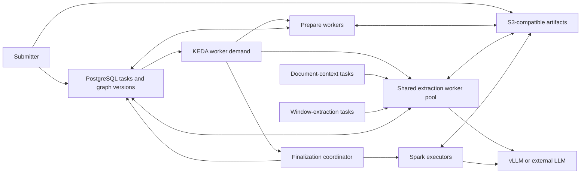
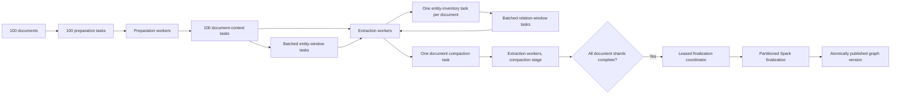

# Deploy on Kubernetes

FlakeGraph runs on any Kubernetes 1.28 or newer: a managed cluster, a
bare-metal fleet, or a single node under kind. It uses Kubernetes for
scheduling, PostgreSQL for durable task leases, S3-compatible storage for
immutable artifacts, Spark for graph-wide finalization, and optionally KEDA
for queue-driven worker scaling. Language models may run in chart-managed vLLM
pods on GPU nodes, or behind any OpenAI-compatible endpoint outside the
cluster; the chart works end to end either way, and without a GPU at all.

This guide is vendor-neutral. The bare-metal reference fleet the chart was
developed on - NVIDIA DGX Spark nodes on k3s - has its own walkthrough in
[Reference: a DGX Spark fleet](reference-dgx-spark-fleet.md), and everything
in it is an example profile, not a default.



## Components

| Component | Owner |
| --- | --- |
| Prepare, context/extract, and finalize workers | FlakeGraph Helm chart |
| Queue-driven scale-to-zero | KEDA PostgreSQL scaler (optional) |
| Spark driver, executor template, and RBAC | FlakeGraph Helm chart |
| Engine pods, each an authenticating sidecar plus one pinned engine | Optional FlakeGraph StatefulSet |
| LiteLLM gateway: keys, budgets, spend, model access | FlakeGraph Helm chart |
| Envoy and the endpoint picker: prefix-aware placement | FlakeGraph Helm chart (engine upstream only) |
| OCR shim and the `mineru-api` pool | FlakeGraph Helm chart (optional) |
| Control plane, routed hostnames, and the sign-in gate | FlakeGraph Helm chart |
| Ingress controller, DNS records, and certificates | Cluster administrator |
| PostgreSQL | Managed service or optional CloudNativePG cluster |
| S3-compatible storage | Managed or self-hosted service |
| Embedding and external model services | Selected provider deployment |
| GPU drivers, device plugin, DCGM exporter | Cluster administrator (in-cluster serving only) |

FlakeGraph does not install object storage or hide its lifecycle inside the
application chart. PostgreSQL stores small coordination records; source bytes,
stage shards, and graph tables move through object storage.

## Work Distribution

Workers pull compatible tasks rather than receiving fixed document partitions.
For 100 documents, submission creates 100 preparation tasks. Each preparation
result adds one context task; that task identifies the source document once and
then adds extraction tasks for its actual body windows. Context and window tasks
share the extraction worker pool, and idle workers continuously claim the next
eligible item.



`prepare_document` performs OCR, normalization, and chunking.
`extract_document_context` identifies ontology-declared focal entities from
bounded front matter and removes a validated bibliography suffix.
`extract_entity_window` produces grounded mentions. A bounded lease may contain
several logical windows, whose provider calls remain independently parallel.
`compact_entity_inventory` deduplicates every mention for the document and fans
out `extract_relation_window` tasks. Each relation window receives that complete
inventory, so it can connect endpoints discovered elsewhere in the document.
`compact_document` assembles relation observations and the inventory into one
immutable document shard. Both compaction stages perform no model inference.
`finalize_graph` starts Spark jobs for identity resolution, graph
assembly, connected-entity selection, quality checks, embeddings, communities,
and versioned Parquet output. Its leased coordinator persists one bounded
phase-progress record, so status clients can show the current operation and
table-write counter without scanning Spark logs or graph-sized task data.

Task claims use renewable PostgreSQL leases. A stopped worker's task becomes
claimable after lease expiry, up to the configured attempt budget. Finalization
uses the complete corpus because independent document-level graphs cannot
resolve identities or communities consistently.

The default five-minute task lease is renewed once per minute and does not cap
task duration. It bounds hard-node-loss recovery while allowing long OCR and
Spark work to continue for as long as its worker remains healthy.

With `autoscaling.enabled`, KEDA queries dependency-ready queued tasks and
active leases for each worker pool. The query stops once it reaches that pool's
configured maximum useful demand: counting the remaining millions of tasks
cannot request more replicas and would only load PostgreSQL. Active leases
remain in the bounded demand, so KEDA can remove idle pods without dropping the
capacity that owns in-flight work. After extraction drains, the prepare and
extract pools reach zero and Spark executors receive the freed CPU and memory.
Spark has higher scheduling priority than workers as a fallback during the
short autoscaler convergence window; model servers remain higher priority than
both. Without KEDA each pool runs its fixed `replicas` and the same queue
semantics hold; only the elasticity is gone.

## Prerequisites

- Kubernetes 1.28 or newer with reliable cross-node networking and DNS
- PostgreSQL 14 or newer: a managed service, or the CloudNativePG operator
  with `database.cloudNativePG.enabled`
- S3-compatible storage reachable by workers and Spark executors, for Spark
  finalization (any S3 API: a cloud bucket, MinIO, Ceph RGW)
- Worker and Spark images for every node architecture (published to GHCR for
  amd64 and arm64 by the release workflow; a fork builds its own)
- Optional: KEDA for queue-driven scaling (`autoscaling.enabled`)
- Optional: a kube-prometheus-stack release for monitoring
  (`monitoring.enabled`)
- Optional, for in-cluster serving: GPU nodes with the NVIDIA device plugin
  or GPU Operator, and a DCGM exporter for the GPU dashboards
- An ingress controller; Traefik or ingress-nginx for the sign-in gate
- Provider and storage credentials stored in Kubernetes Secrets - the
  [chart README](../deploy/helm/flakegraph/README.md#secrets-the-chart-expects)
  lists every one, and a pre-install hook refuses the install while any is
  missing

The chart guards every optional, CRD-backed object on the cluster's own API
discovery: enabling KEDA autoscaling, CloudNativePG, monitoring or Traefik
objects on a cluster without the CRD fails at render time with the name of what
to install (or the `--api-versions` to pass to an offline `helm template`),
rather than at apply time, one object at a time.

For high availability, use at least three control-plane and database members
and spread control-plane, DNS, database, model, and storage replicas across
failure domains. Kubernetes installation is infrastructure ownership rather
than a FlakeGraph concern; the [reference fleet](reference-dgx-spark-fleet.md)
shows one bare-metal path with k3s.

Use capability labels rather than hostnames in values files. The examples use
`flakegraph.io/node-class`, a label prefix the chart owns, but any label works
in a `nodeSelector`:

```bash
kubectl label node <gpu-node> flakegraph.io/node-class=gpu
kubectl label node <cpu-node> flakegraph.io/node-class=cpu
```

Whatever selects GPU nodes for the device plugin (the GPU Operator labels them
itself; the plain device-plugin chart selects on `nvidia.com/gpu.present=true`)
has to be present too: a GPU node the plugin does not run on stays Ready,
reports no allocatable GPU, and takes model pods nowhere.

## Build Images

Release tags publish `ghcr.io/leo-pharma-r-d-data-analytics/flakegraph` and
`.../flakegraph-spark` for `linux/amd64` and `linux/arm64`
(`.github/workflows/publish.yml`), and the chart's `image.tag` follows its
`appVersion`. To build your own, for a fork or a mirror:

```bash
docker buildx create --name flakegraph-builder --use
docker buildx build \
  --platform linux/amd64,linux/arm64 \
  --tag registry.example.com/flakegraph:0.1.0 \
  --push .

docker buildx build \
  --platform linux/amd64,linux/arm64 \
  --file Dockerfile.spark \
  --tag registry.example.com/flakegraph-spark:0.1.0 \
  --push .
```

Pin the resulting image digests in production values. The console reads the
cluster through a bundled kubectl, which supports one minor either side of the
API server: build with `--build-arg KG_KUBECTL_VERSION=v1.xx.y` to match your
cluster. The embedding model is preloaded at build time at a pinned Hub
revision (`KG_LOCAL_EMBEDDING_MODEL`, `KG_LOCAL_EMBEDDING_REVISION`); a site
that cannot reach the Hub at build time sets `KG_PRELOAD_LOCAL_EMBEDDING=false`
and mounts the model instead (see [Scaling](#scaling)). Runtime provider
adapters pin nothing themselves, so a model named without a revision in the
processing config resolves to whatever the Hub serves at that moment; name a
revision or a mounted path wherever reproducibility matters. Leiden community
detection is not in the published images (its `igraph` and `leidenalg`
dependencies are GPL-licensed): a site that selects
`graph.community_algorithm: leiden` builds both images with
`--build-arg KG_INSTALL_LEIDEN=true`, and every pool - finalization runs in the
Spark image - must carry it, or the run fails at community detection.

## PostgreSQL And Storage

For an external database, set `database.secretName` and `database.secretKey` to
a Secret containing a PostgreSQL URI. To use CloudNativePG, install its
operator chart and set `database.cloudNativePG.enabled=true`; the FlakeGraph
chart then creates the declared cluster and uses its application Secret.

Set these object-storage values:

- `artifactStorage.uri`
- `artifactStorage.endpointUrl`
- `artifactStorage.existingSecret`
- `artifactStorage.region`

Before processing data, test put, get, checksum verification, and delete from
both the worker and Spark images. Back up PostgreSQL and object storage as one
system: PostgreSQL contains task/version metadata and object storage contains
the referenced payloads.

### Capacity Sizing

Size PostgreSQL for durable coordination records, indexes, retries, and retained
run versions rather than source-file bytes. A useful first estimate is:

```text
database capacity = projected live metadata x 2 for indexes x 2 for operating headroom
```

Measure `pg_total_relation_size` after a representative sample before loading the
complete corpus. Keep at least 50% free during a run so PostgreSQL can vacuum,
build indexes, and absorb retry or version overlap. The CloudNativePG profile
therefore starts at 100Gi; increase it for corpora whose representative sample
projects beyond 50Gi of live tables and indexes.

Object storage holds source documents, prepared OCR, extraction artifacts, and
partitioned graph tables. Project it independently from a representative sample,
include every retained graph version, and apply the storage service's replication
factor. Object-store capacity commonly exceeds database capacity by an order of
magnitude for PDF-heavy corpora.

## Configure And Install

Three example profiles ship with the chart; start from the one closest to
your cluster and keep site-specific values, endpoints, and Secret references
outside Git under the ignored `deploy/private/` directory:

| Profile | Start here when |
| --- | --- |
| `deploy/examples/minimal-cpu-values.yaml` | There is no GPU and no operator: an Ollama or OpenAI-compatible endpoint, built-in text extraction, fixed replicas. Runs on kind. |
| `deploy/examples/external-provider-values.yaml` | Inference is a hosted or remote provider; the cluster runs the workers, the console, the gateway and the parsing pool. |
| `deploy/examples/dgx-spark-k3s-values.yaml` | A bare-metal GPU fleet like the [reference](reference-dgx-spark-fleet.md). |

```bash
cp deploy/examples/external-provider-values.yaml deploy/private/fleet-values.yaml
cp configs/app-defaults.yaml deploy/private/fleet-config.yaml

helm upgrade --install flakegraph deploy/helm/flakegraph \
  --namespace flakegraph \
  --create-namespace \
  --values deploy/private/fleet-values.yaml \
  --set-file config.content=deploy/private/fleet-config.yaml \
  --set-file ontology.content=configs/ontologies/general.yaml \
  --wait
```

Before anything is applied, a pre-install hook reads every Secret the selected
features reference and refuses the install with the list of what is missing;
`NOTES` prints the same list afterwards. The release is then not reported ready
until an idempotent database-bootstrap Job has validated the mounted processing
configuration, provider credentials, provider binaries, and ontology, then
applied the coordination schema used by workers and KEDA and declared, for
every stage of every enabled worker pool, the configuration digest this release
serves. A missing credential, invalid provider setup, unreachable database, or
incompatible schema therefore fails the Helm operation instead of leaving a
superficially installed but inert worker fleet. Paths supplied only by worker
data volumes are intentionally deferred because the bootstrap hook does not
mount corpus or output storage.

Provider Secrets use an explicit environment-variable allowlist. Keep provider
and model identity in the mounted config, and map only credentials from the
Secret:

```yaml
providerSecret:
  name: flakegraph-providers
  optional: false
  env:
    - name: KG_LLM_API_KEY
      key: KG_LLM_API_KEY
      optional: false
    - name: KG_EMBED_API_KEY
      key: KG_EMBED_API_KEY
      optional: true
    - name: KG_SNOWFLAKE_PASSWORD
      key: KG_SNOWFLAKE_PASSWORD
      optional: true
    - name: KG_SNOWFLAKE_OAUTH_TOKEN
      key: KG_SNOWFLAKE_OAUTH_TOKEN
      optional: true
```

The chart never imports a whole Secret with `envFrom`, so an unrelated key such
as `KG_LLM_MODEL` or `KG_EMBED_MODEL` cannot silently replace reviewed YAML.
The Snowflake entries are optional until a submitted run selects Snowflake as its
output. The final task carries only database, schema, stage, and credential-key
names; the claiming worker resolves the credential value from this Secret.

Use the same processing config for submission and workers. Worker identity,
eligible stages, replica counts, and lease timing may differ; extraction,
model, and graph semantics must match the submitted run. The ontology is the
run's own: a run carries its profile inline in its stored configuration and
every worker applies it when it claims the run, so one fleet builds graphs
with different vocabularies. A run that names none is built with the profile
the workers mount (`--set-file ontology.content=…`), which is what the console
offers as the default types.

The chart creates independent preparation, extraction, and finalization
Deployments and, with `autoscaling.enabled`, one KEDA `ScaledObject` per pool.
PostgreSQL remains the source of truth; KEDA only adjusts capacity and never
owns task state. For an external database, the URI in `database.secretName`
must contain a fully qualified host reachable from the KEDA namespace. The
CloudNativePG profile configures its fully qualified service automatically.

## Inference

Every consumer - the batch pipeline, the console's questions over a graph,
developer tooling - resolves one URL, the LiteLLM gateway, and asks for one of
three aliases: `llm-interactive`, `llm-dev`, `llm-batch`. Where those aliases
go is `gateway.litellm.upstream`.

### An external provider

`upstream.type: external` forwards every alias to any OpenAI-compatible
endpoint - a hosted API, a vLLM or Ollama server on another machine, a cloud
deployment - with no GPU in the cluster at all:

```yaml
gateway:
  litellm:
    upstream:
      type: external
      apiBase: https://inference.example.com/v1   # empty for OpenAI, Azure, Anthropic
      apiKeySecret: {name: flakegraph-upstream, key: api-key}
      models:
        - hosted_vllm/Qwen/Qwen3-8B
    extraModelList: []   # further LiteLLM model_list entries, e.g. an embedding model
```

Models are spelled the way LiteLLM names providers (`openai/gpt-4o`,
`azure/<deployment>`, `ollama_chat/qwen3:8b`, `hosted_vllm/<model>`). Every
alias resolves to each model listed; several models under one alias form a
deployment group LiteLLM balances across. The engines, the placement router
and the sidecar keys are not rendered, and the priority bands below do not
apply - they are a property of engines this chart runs.

### The serving plane

Set `modelServing.enabled=true` with `upstream.type: engine` (the default) to
run one pinned engine per StatefulSet replica on the cluster's own GPUs. Three
classes of consumer share that fleet, and all three take one path:

```
  interactive apps ─┐
  batch pipeline   ─┼─→ LiteLLM ─→ Envoy + picker ─→ [ sidecar → engine ] × N
  developer tools  ─┘   keys        prefix-aware       enforcement floor
                        budgets     placement
                        spend

  consumers ─→ OCR shim (auth · priority queue · admission) ─→ mineru-api pool
```

The default profile serves `Qwen/Qwen3-8B` in bf16 at a pinned revision - a
public, Apache-2.0, dense checkpoint that loads on any GPU with enough memory
and needs no remote code - with chunked prefill, prefix caching, asynchronous
scheduling, and the engine's own default kernels. It assumes a discrete GPU
(`gpuMemoryUtilization: 0.90`), no RuntimeClass (`runtimeClassName: ""`; set it
where GPU pods must name one, as on k3s), and no speculative drafter. Every
model-specific flag is a value: `quantization`, `kvCacheDtype`,
`attentionBackend`, `moeBackend`, `trustRemoteCode`, `reasoningParser`,
`toolCallParser`, `limitMultimodalPerPrompt`. An empty value omits the flag,
and a hardware-specific profile lives in an example file rather than here.

#### Queue-jump, never evict

Interactive work waits for a running batch request to finish, then goes first. A
running request is never preempted and a sequence slot is never held empty, so
compute already paid for is never discarded.

`--scheduling-policy priority` orders the *waiting* queue on `(priority,
arrival_time)`. vLLM has no waiting-to-running preemption, which for this policy
is the desired behaviour rather than a limitation: a high-priority arrival goes
to the head of the queue and takes the next slot to free.

Interactive wait is therefore bounded by how long a batch request runs, not by
scheduling. Expected wait is roughly `D / N`, for batch duration `D` across `N`
concurrent slots, which gives two levers:

- **`llm.max_output_tokens`** shortens `D`. This is the primary latency control.
- **`modelServing.server.maxNumSeqs`** raises `N`, so slots free more often.

#### Interactive-first admission

Admission is only half of it. Once a reply is running, every scheduler step it
takes is shared with whatever else the engine schedules in that step, and with
chunked prefill that includes up to `maxNumBatchedTokens` of *batch prompt*.
On a compute-bound part a 6,000-token batch prompt makes a step several
seconds long, and the person's stream receives nothing until the step ends.
Measured on a GB10 fleet under extraction load: a chat reply admitted first
still streamed at 8 tokens/s.

The sidecar therefore keeps batch prefill off an engine while a person is
being answered on it (`modelServing.sidecar.interactiveFirst`). While any
generation request of a class *not* listed in `heldClasses` is in flight,
new generation requests of the listed classes wait in the sidecar; batch
requests already running keep decoding, which is cheap and shared. They are
released together when the reply has fully left. Past `holdSeconds` one held
request is let through every `trickleSeconds`, so a long agentic session
keeps its engine mostly to itself without stopping batch there outright.
`flakegraph_sidecar_requests_held` and `flakegraph_sidecar_hold_seconds`
report the waiting. Pair it with a `maxNumBatchedTokens` of a few thousand,
so the one stall a reply can still hit — the prefill already in progress
when it arrived — is a second or two rather than ten.

#### Keeping machines ready for people

Interactive-first admission stops *new* batch work reaching an engine while
someone is being answered on it. It does not remove what is already running
there, and on a compute-bound part that is most of the cost: measured on a
six-node GB10 fleet, a reply on an engine with nothing else on it streams
49.5 tokens a second, 13.9 with a single batch sequence beside it, and 1.8
with eight. There is no amount of batch work that is free to leave on a
machine somebody is using.

`modelServing.balancer` therefore keeps whole machines clear. `standby` says
how many are kept ready at all times; a person's request goes to one of them,
and the balancer immediately clears another so the next arrival also finds one
ready. A machine stays reserved for `cooldownSeconds` after the last
interactive request, because agentic sessions are bursty and a machine
re-cleared on every pause between turns is a machine cleared continuously. If
people are sharing machines for longer than `growAfterSeconds`, an extra one
is kept ready, up to `maxReserved`; after `decayAfterSeconds` of no sharing it
is given back. At least one machine always stays with batch work, whatever the
demand.

Nothing restarts: reserving a machine sets its sidecar's batch admission,
which takes effect at once and costs only the drain of what is already running
there - seconds to about two minutes, against the fifteen minutes an engine
takes to start. Every cap carries a time to live in the sidecar, so a balancer
that stops calling leaves the fleet returning to ordinary behaviour rather than
reserved forever. The balancer also writes `flakegraph.io/serving-role` on each
engine pod (`standby`, `serving`, `batch`), which makes the arrangement
legible in `kubectl` and gives a future routing split something to select on;
placement today needs no change, because a cleared engine is the emptiest one
and the picker's queue and KV scorers already prefer it for work that shares
no prefix.

Watch `flakegraph_sidecar_batch_cap` (−1 when uncapped),
`flakegraph_sidecar_requests_held` and `flakegraph_sidecar_hold_seconds`. The
balancer needs one interactive key, read from the same Secret the gateway
presents, and permission to list engine pods and label them; a batch key
cannot lift the cap that is holding batch back.

#### Priority is stamped, never claimed

Each engine binds `127.0.0.1` and a sidecar owns the only exposed port. The
sidecar authenticates the caller, maps the key to a consumer class, strips any
client-supplied `priority`, and stamps the server's band before forwarding.

The stamp is unconditional because vLLM reads a missing `priority` as `0`, which
is its *highest* band — an unstamped request would be promoted, not dropped. For
the same reason an unrecognised class resolves to the band served last.

`/health` and `/metrics` pass through unauthenticated: the kubelet probes the
first and the endpoint picker scores replicas on the second, and neither runs
inference. Adapter-management paths are refused outright.

Two Secrets carry the vocabulary, and they must agree:

| Secret | Key | Holds |
| --- | --- | --- |
| `modelServing.sidecar.keySecret` | `serving-keys.json` | A JSON object mapping each bearer key to a consumer class |
| | `SIDECAR_KEY_INTERACTIVE` / `_DEV` / `_BATCH` | The same key values, read by LiteLLM as environment variables |

LiteLLM presents a different upstream key per model alias, so **priority class is
which alias a virtual key may call**. Restrict each virtual key to one alias and
the mapping cannot be forged: nothing is injected into a request body, and the
sidecar would strip it if it were.

#### Sizing, as a formula

`maxNumSeqs` cannot be a constant — it depends on the model, its quantisation,
the GPU, and the expected context:

```
kv_bytes_per_token = 2 × n_kv_heads × head_dim × n_attention_layers × dtype_bytes
recurrent_per_seq  = n_recurrent_layers × state_bytes_per_layer × slots_per_seq
bytes_per_sequence = kv_bytes_per_token × expected_context + recurrent_per_seq
kv_budget          = (device_memory × gpu_memory_utilization) − weights − overhead
max_concurrent     = kv_budget ÷ bytes_per_sequence

set max_num_seqs  <  max_concurrent
```

The middle line matters only on a hybrid checkpoint whose linear-attention
layers hold a fixed recurrent state per sequence beside the KV cache; a dense
model sets `recurrentLayers: 0`. The last line is load-bearing. vLLM *does*
preempt a running request when it cannot allocate KV blocks, and it evicts the
lowest-priority victim — batch work, mid-flight, against the policy above.
Sizing so the sequence limit binds first keeps that path cold. The sidecar
recomputes this at startup from `modelServing.sizing` and refuses to serve a
configuration that crosses it.

The shipped sizing block is a worked example for the default model on one
80 GB device (an A100 or H100): 8 KV heads, head_dim 128, 36 attention layers,
15.3 GiB of weights, 4 GiB overhead, a 16k expected context, which puts
`max_concurrent` at 23 and `maxNumSeqs` at 16. Re-derive every line for a
different model, device or context, and check it before deploying:

```bash
flakegraph serving sizing --kv-heads 8 --head-dim 128 --attention-layers 36 \
  --kv-cache-dtype auto --weights-gib 15.3 --device-memory-gib 80 \
  --overhead-gib 4 --max-num-seqs 16
```

`--weights-gib` is what the engine reports as "Model loading took", which is
the target checkpoint and any resident drafter together rather than the target
alone. The KV figure the engine itself reports after profiling is the final
word: a vision-language checkpoint reserves encoder memory the formula does not
model, and `maxNumSeqs` then sits with margin below the implied figure.

Speculative decoding (`speculativeTokens`, `speculativeMethod`,
`speculativeDraftModel`) is off by default. Whether a drafter pays, and which
one, is settled with a benchmark on the hardware in hand; a drafter named as a
filesystem path also has to *get* onto that filesystem, which
`draftModelSeed` declares (an image carrying it, or `providedExternally` for a
mount), and a path with neither is refused at render time rather than on the
first node that lacks the file. The [reference fleet](reference-dgx-spark-fleet.md)
carries a measured configuration.

Change one image, model revision, context limit, or concurrency control at a
time and run a gold-set canary before promotion.

#### Placement

Envoy and the endpoint picker share a pod, so the `ext_proc` call stays on
loopback. Envoy terminates the connection, the picker names a replica in
`x-gateway-destination-endpoint`, and an `ORIGINAL_DST` cluster routes there.
The picker scores queue depth, KV utilisation, and prefix affinity, weighted by
`gateway.placement.endpointPicker.scorerWeights`; with
`modelServing.kvEvents.enabled` it indexes what each replica actually holds
rather than hashing prefixes.

The picker selects engine pods by label rather than through an `InferencePool`,
so no Gateway API Inference Extension CRDs are required.

Placement never changes what the engine sees. The body is forwarded verbatim, so
the priority the sidecar stamps is unaffected by where the request lands.

Releasing the application does not have to roll the engines. The engine pod's
auth sidecar is built from the application image, so an `image.tag` bump
would restart every engine - a period of reduced capacity and every open
conversation cut - for a release that changed nothing about the sidecar. Pin
`modelServing.sidecar.imageTag` at the last build that touched
`src/kg_processor/serving/`, and move it deliberately when one does.

### Document parsing

`mineru-api` answers **409 when it is busy**, and FlakeGraph's HTTP transport
does not retry, so a saturated pool would drop documents rather than slow down.
The shim holds that work instead: it authenticates, orders waiting requests by
priority in PostgreSQL, and admits only what the pool can take.

The queue is in PostgreSQL rather than process memory because ordering has to
hold *across* shim replicas — two replicas each ordering their own callers
correctly still serve them in the wrong order relative to each other. Tracking
how much of the pool is busy is what admission control needs anyway, which makes
least-loaded dispatch free.

The shim resolves the parsing pool by one DNS name, so `documentParsing.mineru`
can autoscale underneath it without a configuration change. The pool itself
authenticates nobody, so `documentParsing.mineru.networkPolicy` admits only the
shim; a CNI that filters kubelet probes gets its node range through
`extraIngress`, as with the engines.

Put the pool on a GPU wherever there is one: `documentParsing.mineru.device.mode:
cuda`. Layout, OCR, formula and table recognition are all torch models, and
formula recognition is the stage that decides the matter - on CPU a 32-page
scanned paper took over an hour, on a GPU five minutes at full fidelity. With
`device.claimGpu: true` (the default) the replica requests `nvidia.com/gpu: 1`
and the scheduler places it on a node with a free device; `claimGpu: false`
instead hands the pod every device on its node through a RuntimeClass without
a claim, which is how a single-GPU node shares its one device between an
engine and a parser. `device.virtualVramGiB` tells MinerU what share of the
device is its to batch against.

Born-digital PDFs never reach the pool: the workers extract their text
themselves and send only what that cannot read. A deployment with no scanned
input at all sets `documentParsing.enabled: false` and `ocr.provider:
builtin_text`, as the minimal profile does.

Note that the parsing bands follow the serving convention — **lower is served
first** — while the pipeline's own task queue orders by `priority DESC`. They are
different queues; the shim shares its vocabulary with the sidecar.

### Run priority

`distributed.priority_offset` selects the band a whole run is submitted at. The
stage ladder occupies 0-20, so `0` keeps a run in the bulk band and `1000` puts
it ahead of any backlog. The value must be `0` or at least `1000`: an offset
between the bands would interleave an urgent run with bulk work, which looks
correct until a large corpus arrives.

Within a band, workers claim ready work stage by stage, across every run
(`STAGE_PRIORITY` in `domain/distributed.py`). The two compaction stages rank
first: they make no model call, finish in moments, and each unlocks the next
phase of its document, so a run whose windows are done is never left waiting
behind another run's windows. The model stages follow, earlier stages first.

KEDA gets one trigger per band, so a small urgent run can scale a drained pool
up on its own rather than waiting for a bulk backlog to justify the capacity.
Workers then claim by priority, which is what serves the urgent run first.

### Verifying a fleet

```bash
kubectl -n flakegraph rollout status statefulset/flakegraph-flakegraph-vllm --timeout=60m
kubectl -n flakegraph get pods,pvc,service -l app.kubernetes.io/instance=flakegraph

# Priority cannot be forged: a batch key asking for band 0 is rewritten.
kubectl -n flakegraph logs flakegraph-flakegraph-vllm-0 -c vllm | grep -i 'priority'

# Nothing is evicted mid-flight. This must stay at zero under mixed load.
kubectl -n flakegraph exec flakegraph-flakegraph-vllm-0 -c sidecar -- \
  curl -s localhost:8000/metrics | grep vllm:num_preemptions_total
```

## Access

A deployment is reached by hostname, not by port. `ingress.enabled` publishes
one hostname per routed service under a single `ingress.domain` — the control
plane, the LiteLLM gateway, and the OCR shim — terminated by whatever ingress
controller the cluster already runs. Host-based rather than path-based, because
each application assumes it owns the root and because an OIDC redirect URI has
to be a stable absolute URL. A NodePort still reaches a Service from inside the
cluster's own network and remains useful while bringing a cluster up, but its
number is reassigned whenever the Service is recreated, and the hostname is
not - and a NodePort on the gateway publishes its admin UI on every node
address along with the API.

`ingress.controller` names how the rest is expressed. `none` renders plain
Ingress objects that work everywhere and nothing else. `traefik` and `nginx`
can carry the sign-in gate; `traefik` alone carries edge compression and the
console's machine-key route, both of which ingress-nginx cannot express without
configuration snippets it disables by default.

`ingress.authProxy` puts one sign-in gate in front of the browser-facing hosts
rather than an identity integration inside each application, so a deployment's
authentication stops being whichever application authenticates worst, and an
application that cannot speak OIDC is covered too. The gate keeps a hostname of
its own, so the sign-in and callback endpoints are not behind the gate they
exist to open. Its cookie spans the domain: one sign-in covers every host under
it, and `/oauth2/sign_out` on the gate's own host ends that session everywhere.
Any OIDC issuer works; with `emailDomain: "*"` the issuer's own application
assignment is the whole access control.

Behind the gate the control plane does not authenticate its callers a second
time. It reads the identity the gate established from the `X-Auth-Request-*`
headers - user, email, preferred username, and groups, which it maps to roles
- and only from those. Two things make trusting them sound. First,
`controlPlane.networkPolicy`: enable it, name the ingress controller as the
only permitted peer, and confirm by forging a header from a pod that should not
be able to reach the application at all. It is off by default because the
correct peer is site-specific and a policy naming the wrong one leaves the
application unreachable rather than unprotected — but the chart refuses to
render the gate without it, since a gate whose header anyone in the cluster can
forge is not a gate. Second, the edge removes every identity-shaped header a
client sent before the gate runs: on Traefik an identity-strip Middleware
stands first in the gated chain and blanks every `X-Auth-Request-*` and
`X-Forwarded-*` identity header, and on ingress-nginx `auth-response-headers`
replaces the `X-Auth-Request-*` set on every forwarded request. A signed-in
viewer therefore cannot become somebody else by adding a header.

`ingress.compression` compresses responses at the edge. The console serves a
graph to the browser as one JSON payload, tens of megabytes before compression
for a few thousand entities, and the console's own gzip never reaches it:
Next.js hands its compression filter a Content-Type list for route handler
responses, which the filter rejects as not compressible. The setting renders a
Traefik `compress` Middleware and appends it to the ingress chain after the
gate, so it needs `ingress.controller: traefik`. It is off by default; an edge
that compresses on its own (ingress-nginx's `use-gzip`, a CDN) needs nothing.

### Callers that are programs

A caller holding an API key cannot satisfy a browser sign-in, so the paths
those callers use are routed past the gate and left to the key check each
service already performs: `ingress.machineApiPaths.gateway` for inference and
`ingress.machineApiPaths.ocr` for `/file_parse`. Every path listed there
refuses an unauthenticated request with 401 on its own; nothing else stands in
front of it.

They are matched exactly, and that is the point rather than an implementation
detail. The gateway declares its key check per route rather than globally, so
`/v1` is not a namespace that authenticates — it is a namespace that mostly
does. Routing the prefix would have published whatever else the build serves
under it: this one answers `/v1/mcp/oauth/authorize` to anyone, which is an
unauthenticated credential-entry page, an open redirector, and a signing oracle
for the master key. Callers therefore carry `/v1` in the base URL, unversioned
aliases stay behind the gate, and a path is added only after it has been
observed refusing an unauthenticated caller — and observed again on the next
image bump.

The console is the one routed service that cannot be listed there: it trusts
the gate's identity header, so routing it past the gate would let any caller
assert any identity. Its programs authenticate differently. The console mints
API keys of its own (the SDK keys page, `GET /api/docs` for the catalog), and
`ingress.authProxy.machineKeys` routes a request that presents one — as
`Authorization: Bearer fg_…` or `X-Flakegraph-Api-Key` — to the console's API
paths past the gate, on a Traefik route that first strips every identity
header the gate would have set. A key holder is therefore a machine and never
a person: the console refuses a key it does not hold, and with
`controlPlane.auth.required` refuses any caller that is neither a key holder
nor someone the gate signed in. Browser traffic carries no such header and
meets the gate as before.

```bash
# A machine path answers its own key check rather than a sign-in redirect.
curl -so /dev/null -w '%{http_code}\n' "https://llm.$DOMAIN/v1/models"

# The console's API with a console key: served, as a machine. Without one, the gate.
curl -so /dev/null -w '%{http_code}\n' -H "Authorization: Bearer $FLAKEGRAPH_API_KEY" \
  "https://flakegraph.$DOMAIN/api/trpc/auth.session?batch=1&input=%7B%220%22%3A%7B%22json%22%3Anull%7D%7D"

# Everything else meets the gate: this must not return the application.
curl -sI "https://llm.$DOMAIN/ui" | grep -i '^location:'
```

The gateway also reconciles two differences between the contract it
advertises and the engine behind it, in one hook (`gateway/message_order.py`,
loaded from beside the proxy's config) that runs on both the chat-completions
and the Responses routes. The OpenAI chat format admits `system` and
`developer` messages anywhere, and a coding harness resuming a session sends
its instruction updates between turns; the engine's chat template accepts
instruction messages only while they lead the conversation, so the hook moves
late instruction messages to the front in the order they arrived. The same
format lets a tool call carry any string as its arguments, while the engine
parses them as JSON to render its template; a stream cut off mid tool call (an
engine restart) leaves the harness holding the prefix it had received, and
every later turn of that conversation would be refused. The hook keeps such
arguments, wrapped as `{"partial_arguments": "..."}`, so the conversation can
go on. Nothing is reworded, and a conversation that already fits passes
through untouched.

## Submit And Export

From an environment that can reach PostgreSQL and the configured source:

```bash
export KG_DISTRIBUTED_DATABASE_URL='postgresql://...'

uv run flakegraph distributed init --config configs/your-config.yaml
uv run flakegraph distributed submit --config configs/your-config.yaml --owner name@example.com
uv run flakegraph distributed status --run-id <run-id> --config configs/your-config.yaml
```

Every distributed run records who its graph belongs to. A new graph needs an
owner - `--owner`, `job.owner` in the configuration, or `KG_JOB_OWNER` - and
`distributed submit` refuses without one; a revision takes the owner its base
run recorded unless `--owner` names another. The console shows a graph only to
its owner and the people they share it with, and runs submitted through the
console record the signed-in person, so a graph started from the command line
appears for its owner there without further steps.

Before submitting against a bucket or container, see what the run would read:

```bash
uv run flakegraph sources list --config configs/your-config.yaml --limit 50
```

This prints a JSON array of `{uri, name, size_bytes, modified_at, checksum}`
from the listing alone — nothing is downloaded, and the same include globs and
suffix rules the run applies decide what appears. Local paths, S3-compatible
buckets and Azure containers can be listed; a manifest or a Snowflake stage,
which the pipeline only discovers by fetching, exits with status 2 instead of
quietly pulling the corpus. The console's source browser and PII scan call
this command for object-storage sources, so the count it shows before "Start"
is the count the run ingests, read with the pipeline's own credentials.

Every worker emits one `worker_ready` JSON event containing its eligible stages,
provider/model identities, and semantic `config_digest`; endpoints and credentials
are omitted. `distributed status` compares the caller's digest with the run and
reports machine-readable diagnostics. `CONFIG_DIGEST_MISMATCH` means those
settings cannot claim the run. `FLEET_DIGEST_MISMATCH` means the workers
serving a stage the run still has work in declared another digest — the fleet
was upgraded past the run. `QUEUED_WORK_NOT_ADVANCING` means queued work has
not been claimed for at least 60 seconds; inspect pod readiness and confirm that
an eligible worker advertises the run digest.

### Revising a graph

A graph is edited by running it again, not by rewriting what a run produced.
`distributed revise` submits a new run of the same graph that keeps a finished
run's documents, leaves out the ones named by `--drop-file`, and adds whatever
the configured source holds that the graph does not yet:

```bash
uv run flakegraph distributed revise \
  --base-run <run-id> \
  --drop-file <file-id> \
  --config configs/revision.yaml
```

The workers prepare and extract only the added documents. The kept ones are
read from the base run's stage outputs where they already are - nothing is
copied - and the finalizer rebuilds the graph from both, so entity resolution
and communities see every document together. A source file whose bytes the
graph already holds, under any name, is skipped; one whose identity it holds
with other bytes replaces the older version. A revision that would add nothing
and drop nothing is refused. Once it succeeds the graph's head moves to the new
version and the earlier version stays readable by its run id. `--no-add-documents`
revises without a source, for a run that only removes.

After completion:

```bash
uv run flakegraph distributed export \
  --run-id <run-id> \
  --output out/fleet-run \
  --config configs/your-config.yaml

uv run flakegraph inspect html --output out/fleet-run --open
```

The submitter stores source bytes in the artifact store, so workers do not need
the submitter's filesystem mount.

## Scaling

Set capacity ceilings once; KEDA handles ordinary scale-up, scale-down, and the
handoff to Spark. The shared extraction pool claims one document-context task
per document, then an entity-window wave, an inventory barrier, and an
independent relation-window wave. Both window waves are dynamically claimed;
bounded task packs may process several logical windows concurrently. A worker
owns one lease at a time, while `graph.extraction_parallelism` bounds provider
calls inside that lease.

For in-cluster serving, provider capacity is approximately model replicas
multiplied by `modelServing.server.maxNumSeqs`; for an external provider it is
whatever rate limit the provider grants the key. Size the extraction ceiling as
provider capacity divided by `graph.extraction_parallelism`, rounding down to
avoid a permanent overload. Increase sequence capacity, batched-token capacity,
and context length separately while observing queue depth, generation
throughput, GPU utilization, and memory. Context and compaction tasks use less
model concurrency, so KEDA may temporarily schedule below the ceiling without
leaving sustained extraction work idle. The figure to size against is the KV
capacity the engine reports after profiling, not the one the sizing block
implies before it.

Spark finalization scales with executor instances and cores. The finalization
coordinator remains one leased task, but graph rows stay partitioned across
executors and object storage. Provider-backed phases use several small work units
per executor slot and bounded in-partition concurrency, allowing Spark to keep
assigning work when individual model requests have variable latency. The default
three-minute LLM request timeout prevents one stalled call from indefinitely
serializing a stage; raise `llm.timeout_seconds` only for a measured provider that
needs a longer decode window. Small corpora may still be dominated by model
startup, the final extraction straggler, Spark startup, and atomic publication.

Executors must be able to load the embedding model without reaching the network,
and the failure when they cannot is unusually hard to read: the stage does not
error, it stops advancing. Finalization constructs the encoder once per
partition, so a model resolution that raises inside a Spark task is retried by
the task, and a job that is failing every attempt looks exactly like a job that
is working slowly.

The published images preload the embedding model at a pinned revision, which
is the simplest arrangement. Where the image cannot carry it, the most reliable
alternative is to mount the model as a plain directory and name it by path,
which involves no model-hub code at all:

```yaml
embedding:
  provider: sentence_transformers
  model: /models/Qwen3-Embedding-0.6B   # a path, not a hub identifier

extraEnv:
  # Any accidental hub lookup then fails at once instead of retrying.
  - {name: HF_HUB_OFFLINE, value: "1"}
  - {name: TRANSFORMERS_OFFLINE, value: "1"}
extraVolumes:
  - {name: models, persistentVolumeClaim: {claimName: embedding-models}}
extraVolumeMounts:
  - {name: models, mountPath: /models, readOnly: true}
```

Produce that directory with `SentenceTransformer(name).save(path)`. Copying a
populated hub cache between machines is less dependable than it looks: a cache
written by one `huggingface_hub` version can satisfy `snapshot_download(...,
local_files_only=True)` and still not satisfy the loader that reads it.

The embedding model is part of the compatibility contract, so this path must be
identical in the deployed configuration and in every submitted run, or no worker
claims the run.

`extraVolumes`, `extraVolumeMounts`, and `extraEnv` reach worker pods and Spark
executors alike, because executors run the same application code. Use a
`ReadWriteMany` volume rather than a `hostPath` on any cluster larger than one
node — a `hostPath` silently resolves to an empty directory on every node that
was not the one staged.

Executors strongly prefer distinct topology domains but may co-locate if a node
is unavailable, preventing a temporary capacity reduction from leaving the
entire finalization job unschedulable.

For a homogeneous 20-node GPU cluster with one sixteen-sequence engine per
node and 20-core nodes, the site-specific values are limited to capacity
declarations:

```yaml
modelServing:
  replicas: 20

workers:
  prepare:
    autoscaling:
      # Four four-core OCR workers fit beside an engine on each 20-core node.
      maxReplicas: 80
  extract:
    autoscaling:
      # 20 replicas * 16 sequences / 2 calls per extraction task.
      maxReplicas: 160

spark:
  executorInstances: 20
```

The bundled CloudNativePG profile reserves 300 database sessions for worker
ceilings of that order plus KEDA, Spark, and operator traffic. When using an
external PostgreSQL service, provide an equivalent direct-connection budget or
place a supported transaction-mode pooler in front of it; do not scale worker
pods beyond the database service's connection capacity.

Use node labels and resource requests to describe heterogeneous clusters. Do
not encode hostnames or split document lists per machine; all workers claim
from the same queue, and one slow document cannot strand an assigned partition.

Before the first production corpus, validate that all expected nodes are Ready,
all GPUs are allocatable, model replicas are spread, ScaledObjects are healthy,
and no Spark executor is permanently Pending:

```bash
kubectl get nodes
kubectl get nodes -o json | jq -r \
  '.items[] | [.metadata.name, .status.allocatable["nvidia.com/gpu"]] | @tsv'
kubectl -n flakegraph get statefulset,pod -l app.kubernetes.io/component=model-serving -o wide
kubectl -n flakegraph get scaledobject,hpa
kubectl -n flakegraph describe scaledobject
```

Run a representative canary through OCR, extraction, finalization, export, and
gold-set evaluation after every Kubernetes, driver, model, provider, image, or
chart upgrade. Promote the exact image digests and values only after the canary
and the recovery drill below succeed.

### Upgrading a fleet with runs in flight

A worker claims only tasks whose run was planned under its own configuration
digest, and the demand signal counts only work the declared fleet can take. A
change to provider, model, prompt, or graph settings therefore leaves every
run in flight with no workers and no autoscaling demand: it does not fail, it
waits. Drain first — `distributed list` should show nothing active — before a
digest-changing upgrade. Where that was not possible, `distributed status`
reports `FLEET_DIGEST_MISMATCH` on the run; roll the fleet back, or cancel the
run and resubmit it under the new configuration.

The declaration itself is the bootstrap hook's, not only the workers': each
worker declares its digest when it starts, but a pool that has scaled to zero
has no worker to declare a new one, and the demand signal would go on counting
nothing for it. `distributed init --serve-stage` records the release's digest
for every enabled pool's stages at every install and upgrade, so a run
submitted under the new configuration scales the idle fleet up.

## Observability

`monitoring.enabled` turns the deployment into something that can be watched
rather than polled. It assumes a kube-prometheus-stack release named
`monitoring.release` whose Prometheus selects ServiceMonitors, PodMonitors and
PrometheusRules from the release namespace (the stack's
`*SelectorNilUsesHelmValues: false` settings). The stack may run in the release
namespace or elsewhere (`monitoring.namespace`): in the namespace, the chart
publishes Grafana behind its own sign-in gate; elsewhere, it writes the
dashboards and the database datasource into the stack's namespace for its
sidecars to load, admits its Prometheus through the NetworkPolicies, and leaves
Grafana's publication to the stack's own ingress. Either way the chart renders
everything that is specific to this deployment — scrape targets, alert rules,
the read-only database role Grafana queries through, the dashboards — so a
`helm upgrade` is what changes them, and a deployment installed from the chart
arrives with its dashboards rather than acquiring them by hand. The database
role and datasource need `database.cloudNativePG.enabled`; with a managed
database, create `monitoring.database.role` in `pg_read_all_data` and provision
the datasource by hand.

Grafana behind the gate signs a visitor in as whoever the gate already
identified, from the same `X-Auth-Request-Email` header the control plane
trusts and under the same condition: a NetworkPolicy admits only the ingress
controller and the Prometheus that scrapes it, because to anything else that
header is just a header. New visitors are viewers; Editor is a role an admin
hands out. The six provisioned dashboards are read-only and change with the
chart.

What is measured, and where it comes from:

| Source | Series | Notes |
| --- | --- | --- |
| Engines | `vllm:*` via the auth sidecar on `http` | Tokens/s, running and waiting, KV-cache use, time to first token, inter-token latency, prefix-cache hits, preemptions, speculative acceptance. Labelled `engine` (pod) and `node`. |
| Auth sidecar | `flakegraph_sidecar_*` | The only per-consumer-class view of the engines: requests, duration, in-flight, the priority band stamped. Appended to the engine's scrape. |
| Endpoint picker | `llm_d_epp_*` on `metrics` | Scraped with the scraper's ServiceAccount token; the chart grants the picker the TokenReview and SubjectAccessReview rights its metrics filter needs to evaluate one. |
| Gateway | `litellm_*` | Requests, tokens, latency per virtual-key alias and model. The Prometheus callback is enabled only with monitoring on, because it is not free per request. |
| OCR shim | `flakegraph_ocr_*` | Queue depth and oldest wait by class, queue-wait and parse-duration histograms, in-flight against capacity per parsing replica. |
| Database | `cnpg_*` from CloudNativePG's exporter | Includes operator-defined queries over the task queue — counts by stage, status, and band, failures in the last hour, expired leases, tasks on their last attempt, worker demand per pool — so the pipeline is alertable without instrumenting the workers. |
| Hosts | `DCGM_FI_DEV_*`, `node_*`, `kube_*` | GPU utilisation, power, and temperature from a DCGM exporter, which is a prerequisite the chart does not install (the GPU Operator brings one; `deploy/spark/install-cluster.sh` installs one). The Fleet Overview dashboard reads it from whichever namespace scrapes it, through its DCGM namespace variable. CPU, memory, disk from node-exporter. |

Grafana also has a second datasource, the database itself, through a role that
is a member of `pg_read_all_data` and nothing more. Prometheus is right for
what is happening; the task, run, and OCR tables and the gateway's spend log
are the record of what happened, with durations, errors, and per-key token
totals that survive any restart. The **Pipeline Workers** and **Gateway &
Consumers** dashboards draw their history from there.

The dashboards, in the *FlakeGraph* folder:

- **Fleet Overview** — the landing page: what is running now, one row per
  host, and throughput history across engines, consumer classes, parsing, and
  the pipeline.
- **LLM Serving** — per-engine load, latency percentiles, token
  distributions, cache and speculation, request outcomes, and the router.
- **Gateway & Consumers** — who is using inference: requests and tokens by
  key alias and model, live and historical.
- **Document Parsing (OCR)** — queue, replica saturation, parse durations,
  and the rows waiting right now.
- **Pipeline Workers** — task queues by stage and band, demand against the
  replicas KEDA provided, completions and durations per stage, failures with
  their errors.
- **Database & Storage** — connections, size, WAL, checkpoints, every
  volume's use, and pods that are not ready.

They are generated: `deploy/grafana/build_dashboards.py` writes
`deploy/helm/flakegraph/dashboards/*.json`, and a test fails when the two
drift, so a panel is changed in the generator and regenerated, never edited
in Grafana.

The chart's `PrometheusRule` covers what the serving design promises and what
the pipeline needs an operator for: a preemption (the invariant behind
[queue-jump, never evict](#queue-jump-never-evict)), an engine, gateway, or
shim that stops answering, sustained KV-cache saturation, slow time to first
token, a parsing queue whose oldest request is stale, parsing upstreams
failing, tasks failing, tasks on their last attempt, expired leases, and
worker demand a pool is not meeting. Every threshold is a key under
`monitoring.rules.thresholds`. Pods, nodes, and volumes are covered by the
stack's own rules. Alertmanager routing belongs to the stack's own values (the
reference profile's `deploy/spark/monitoring-values.yaml` ships with no
receiver); until one exists the alerts are visible on the overview dashboard.

## Recovery

- `distributed status` shows bounded stage counts, configuration compatibility,
  and stalled-queue diagnostics. Add `--include-tasks` for attempts, leases,
  errors, and outputs of individual tasks.
- `kubectl get scaledobject,hpa -n flakegraph` shows worker demand and capacity.
- `distributed cancel` stops unfinished work without deleting successful artifacts.
- `distributed retry --run-id <run-id>` requeues terminally failed tasks after
  the underlying provider, configuration, or storage issue is corrected, and
  resumes a cancelled run where it stopped.
- `distributed delete --graph-id <graph-id>` deletes a graph for good: every
  run of it, their coordination rows, and every object under their prefixes
  in the artifact store (stage outputs, Spark checkpoints, the published
  parquet). A graph is deleted whole because a revision is built from the
  stored outputs of the versions before it. It is refused while any run of the
  graph is queued or running; an interrupted delete is finished by running it
  again. The console's Delete does this and also removes its own records.
- Worker and executor loss is recovered through task leases or Spark partition
  recomputation; incomplete finalization never publishes a graph version.
- Set pod termination grace longer than the task lease when graceful completion
  is preferred over lease recovery.
- A node that needs a reboot - a kernel or driver update - is drained first,
  one node at a time (`deploy/spark/node-maintenance.sh drain <node>` wraps
  `kubectl drain` with the right timeouts, on any cluster). The disruption
  budgets the chart declares let a single engine and a single parsing replica
  be unavailable, so the others keep serving while this one warms up; a node
  rebooted without draining takes its engine down mid-request and the router
  keeps sending it traffic for as long as it spends warming up. A
  single-instance database has no budget: it restarts with its node, and a
  budget that could only wedge the drain is not declared for it.

Validate recovery by deleting workers during extraction, restarting the
database primary, stopping a provider replica, and deleting a Spark executor
during finalization. Use non-sensitive canary data and confirm that retries do
not create duplicate successful outputs.

For unattended operation, enable [monitoring](#observability): its rules
cover terminal task failures, tasks nearing their attempt limit, expired leases,
unmet worker demand, engine readiness, and KV-cache pressure, and the stack's
own cover unschedulable pods, volumes filling, and database health. Object-store
errors and Spark executor loss still surface only in logs. Worker loss is
expected and recoverable; a terminal task failure is an operator-visible
outcome, never an indefinitely hung run.

## Appendix: networks that intercept TLS, and hardened images

None of this applies to most clusters. Two environmental conditions have
come up often enough to document.

**A network that terminates TLS on egress** re-signs certificates with its own
root. A host or container without that root fails every download in a way that
reads as a firewall block — transfers stop at zero bytes or return a redirect
to the proxy's own page. Containers carry their own trust stores, so the root
has to reach each one: `extraEnv`/`extraVolumes`/`extraVolumeMounts` on the
workers, `modelServing.extraEnv`, `gateway.litellm.extraEnv` and
`documentParsing.mineru.extraEnv` mount a bundle and point `SSL_CERT_FILE`,
`REQUESTS_CA_BUNDLE` and `CURL_CA_BUNDLE` at it; the image builds take the
bundle as a build secret (`--secret id=ca-bundle,src=...`). Python is affected
worse than most: `curl` verifies against the system store while `httpx` and
`requests` verify against `certifi`, so the same URL succeeds under one and
fails under the other, and a proxy whose chain omits the Authority Key
Identifier fails strict X.509 verification even once trusted. Which hosts are
intercepted also changes without anything in the cluster changing, so re-test a
download that used to fail rather than carrying an old verdict forward.
`documentParsing.mineru.modelSource: modelscope` is an alternative weight
source where the Hub's CDN host is intercepted.

**A hardened operating-system image** may blacklist the `overlay` filesystem,
without which no container runs; worse, a blacklist written as `install
overlay /bin/true` makes `modprobe overlay` exit successfully while loading
nothing. Verify with `grep -w overlay /proc/filesystems`, never with
`modprobe`'s exit status. `deploy/spark/bootstrap-node.sh` lifts that one
directive on the nodes it prepares and is a no-op elsewhere.

The application-layer contracts behind the deployment are described in
[Architecture](architecture.md).
