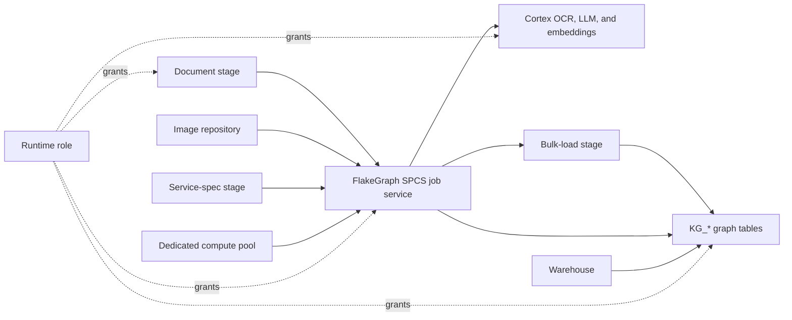
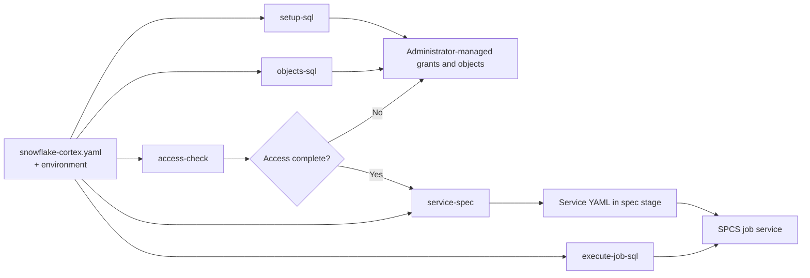
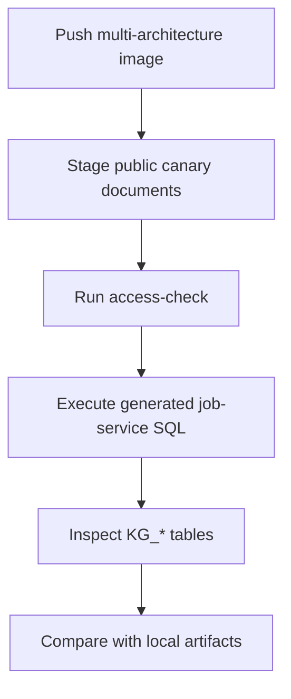

# Snowflake Setup

This guide is intentionally account-neutral. Use it as a checklist for a target
Snowflake account, but do not commit real account locators, user emails, role
names from private tenants, image digests, stage listings, or access-audit
transcripts back to the repository.

FlakeGraph can run locally without Snowflake. Snowflake mode uses the same
pipeline with Snowflake stages, Cortex functions, Snowflake tables, and
Snowpark Container Services.

The optional [Streamlit application](../app/README.md) provides stage upload and
listing, queue submission, per-run SPCS launch, live `KG_JOB_FILE` progress, and
graph exploration through the active Snowpark session. It is a control plane;
the launched SPCS worker remains responsible for OCR, extraction, embedding,
and graph writes.



## Required Objects

A production deployment needs the objects shown above: a runtime role,
warehouse, database/schema, three purpose-specific stages, image repository,
and dedicated Snowpark Container Services compute pool.

Avoid relying on account-provided system compute pools for job services. Create
or grant a dedicated service-compatible pool such as `KG_PROCESSOR_CPU_POOL`.

## Minimum Grants

| Scope | Required capability |
| --- | --- |
| Warehouse, database, schema, compute pool | `USAGE` |
| Input document stage | `READ` |
| Bulk-load and service-spec stages | `READ`, `WRITE` |
| Image repository | `READ`, `WRITE` |
| Deployment schema | `CREATE TABLE`, `CREATE STAGE`, `CREATE IMAGE REPOSITORY`, and `CREATE SERVICE` when the runtime role owns setup |
| Graph tables | `SELECT`, `INSERT`, `UPDATE`, and `DELETE` (these privileges cover `MERGE`) |
| Cortex | `SNOWFLAKE.CORTEX_USER` plus required account AI grants |
| Compute pool | `CREATE COMPUTE POOL ON ACCOUNT` or `USAGE` on a pre-created pool |

## Configuration

Start from [configs/snowflake-cortex.yaml](../configs/snowflake-cortex.yaml) and
provide account-specific values through environment variables:

```bash
export KG_SNOWFLAKE_ACCOUNT="your-org-your-account"
export KG_SNOWFLAKE_USER="your-user"
export KG_SNOWFLAKE_AUTHENTICATOR="externalbrowser"
export KG_SNOWFLAKE_DATABASE="KG_DB"
export KG_SNOWFLAKE_SCHEMA="GRAPH"
export KG_SNOWFLAKE_ROLE="KG_PROCESSOR_ROLE"
export KG_SNOWFLAKE_WAREHOUSE="KG_PROCESSOR_WH"
export KG_SNOWFLAKE_STAGE="@KG_DB.GRAPH.KG_DOCS"
export KG_SNOWFLAKE_BULK_STAGE="@KG_DB.GRAPH.KG_LOAD_STAGE"
export KG_SNOWFLAKE_IMAGE_REPOSITORY="KG_DB.GRAPH.KG_IMAGES"
export KG_SNOWFLAKE_IMAGE_NAME="flakegraph:0.1.0"
export KG_SNOWFLAKE_COMPUTE_POOL="KG_PROCESSOR_CPU_POOL"
export KG_SNOWFLAKE_SERVICE_NAME="KG_PROCESSOR_JOB"
export KG_SNOWFLAKE_SERVICE_SPEC_STAGE="@KG_DB.GRAPH.KG_SERVICE_SPECS"
export KG_JOB_LEASE_OWNER="flakegraph-worker-1"
export KG_STAGE_PREFIX="incoming"
export KG_LLM_MODEL="llama3.3-70b"
export KG_EMBED_MODEL="snowflake-arctic-embed-l-v2.0"
export KG_EMBED_DIM="1024"
```

Set `KG_SNOWFLAKE_IMAGE_DIGEST` to the pushed `sha256:<64-hex-digest>` before
rendering production service SQL. Set
`KG_SNOWFLAKE_COMPUTE_POOL_INSTANCE_FAMILY` only when `setup-sql` should create
the pool; omit it when an administrator has already provisioned the named pool.
`KG_JOB_LEASE_OWNER` must identify the worker uniquely whenever more than one
file-queue worker can run concurrently.

For unattended Snowpark Container Services runs, prefer OAuth file auth inside
the container or key-pair auth for a dedicated service user. Keep private keys,
OAuth tokens, passwords, and generated session tokens outside Git.

Browser SSO re-authenticates on every connection, which interrupts multi-step
deployment sequences with repeated browser prompts. Set
`KG_SNOWFLAKE_STORE_TEMPORARY_CREDENTIAL=true` to reuse a cached token instead.
It requires a keyring backend, which the connector treats as optional:

```bash
uv sync --extra sso-cache
```

Without that extra the connector warns and continues to prompt. The setting is
opt-in because caching writes a short-lived token to the operating system
credential store. It has no effect inside SPCS, where the mounted OAuth token
already avoids interactive authentication.

## Document Identity

Snowflake reports its own MD5 for staged files. Every other file source records a
SHA-256 of the bytes, so adopting the provider value would give one document two
identities depending on which runtime ingested it, and any comparison that binds
a document by checksum — including gold-fixture evidence grounding — would fail
for reasons unrelated to extraction quality.

Staged files are therefore read once to produce the same content hash as
elsewhere, and Snowflake's value is retained separately as provenance. Set
`KG_STAGE_CONTENT_HASH=false` to skip that read where cross-runtime comparison
and gold evaluation are not needed; the recorded checksum is then Snowflake's
own and is not comparable with other sources.

## Build And Push The SPCS Image

SPCS currently requires a `linux/amd64` image. Cortex supplies OCR and model
inference, so exclude the larger local OCR and embedding dependencies from this
image. Disable BuildKit provenance to push a single image manifest that SPCS can
pull directly:

```bash
docker buildx build \
  --platform linux/amd64 \
  --provenance=false \
  --load \
  --build-arg KG_INSTALL_MINERU=false \
  --build-arg KG_INSTALL_LOCAL_EMBEDDINGS=false \
  --build-arg KG_PRELOAD_LOCAL_EMBEDDING=false \
  --tag flakegraph:snowflake .

snow spcs image-registry login
REGISTRY="$(snow spcs image-registry url)"
docker tag flakegraph:snowflake \
  "$REGISTRY/kg_db/graph/kg_images/flakegraph:0.1.0"
docker push "$REGISTRY/kg_db/graph/kg_images/flakegraph:0.1.0"
```

Use `snow spcs image-repository list-images KG_DB.GRAPH.KG_IMAGES` to read the
uploaded digest, then set `KG_SNOWFLAKE_IMAGE_DIGEST` before rendering the
service spec. Pinning that digest makes each run reproducible even if a tag is
later reused.

## Generated SQL And Specs

Render the account setup and runtime artifacts locally before applying them:

```bash
uv run flakegraph snowflake setup-sql --config configs/snowflake-cortex.yaml
uv run flakegraph snowflake objects-sql --config configs/snowflake-cortex.yaml
uv run flakegraph snowflake access-check --config configs/snowflake-cortex.yaml
uv run flakegraph snowflake submit --config configs/snowflake-cortex.yaml
uv run flakegraph snowflake service-spec --config configs/snowflake-cortex.yaml
uv run flakegraph snowflake execute-job-sql --config configs/snowflake-cortex.yaml
```

`setup-sql` includes role/grant-oriented statements. `objects-sql` renders only
schema objects and is safer for environments where administrators manage grants
separately. `submit` lists the configured document stage and idempotently creates
the `KG_JOB_FILE` queue rows that SPCS workers claim. It does not invoke Cortex
or start the compute pool, so review its reported file count before executing the
job service.

The generated service spec embeds the complete effective processing
configuration as a compact, secret-free runtime payload. This preserves graph,
OCR, embedding, ontology, and finalization settings selected by a CLI or app run
instead of falling back to defaults baked into the image. Local passwords,
tokens, private keys, and external-provider credentials are excluded; SPCS
supplies its scoped Snowflake OAuth token at runtime, and explicit container
environment variables retain highest precedence.

By default, `access-check` makes three deliberately small Cortex calls: an
eight-token completion, one embedding, and the first page of one staged PDF.
These canaries catch model, grant, region, and account-tier restrictions before
SPCS starts. Use `--skip-cortex` when an object-only, non-AI audit is required.



## Live Validation

Once the account objects and grants exist:

1. Push the Docker image to the configured Snowflake image repository.
2. Upload or stage at least one public test document under the configured stage
   prefix.
3. Run `uv run flakegraph snowflake access-check --config configs/snowflake-cortex.yaml`.
4. Run `uv run flakegraph snowflake submit --config configs/snowflake-cortex.yaml` and verify
   the queued file count.
5. Execute the rendered job-service SQL.
6. Inspect the `KG_*` tables or export local artifacts for parity comparison.

The repository keeps live Snowflake tests opt-in. Set `KG_RUN_SNOWFLAKE_LIVE=1`
only in an environment where the required account values and permissions are
provided externally.


